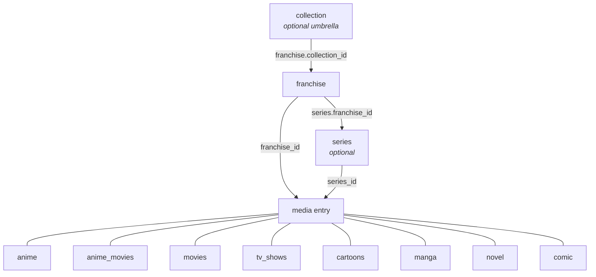

# Data Model

Last verified: 2026-09-05

**What this is for.** This is the reference for every table the app stores, as
declared by the SQLAlchemy models in `app/models/*.py`. It tells you what each
table is for, what each column holds, which constraints the database enforces,
and how tables point at each other - including the tables that point at
"any media entry" without a foreign key. It replaces the older
`data-model.md`, which had drifted from the code (see
[Corrections to the old schema doc](#corrections-to-the-old-schema-doc)).
Enum values are **not** repeated here: every closed vocabulary lives in
[`options.md`](options.md), and what each media type is for lives in
[`entry-types.md`](entry-types.md).

## Table of contents

- [The hierarchy](#the-hierarchy)
- [Conventions shared by every table](#conventions-shared-by-every-table)
- [Grouping tiers](#grouping-tiers): collection, franchise, series
- [Media entries](#media-entries): anime, anime_movies, movies, tv_shows, cartoons, manga, novel, novel_unit, comic
- [Virtual fields on media entries](#virtual-fields-on-media-entries)
- [People, studios and links](#people-studios-and-links): person, person_role, studio, character, character_casting, media_credit, media_tag
- [Where an entry can be watched or read](#media_source): media_source
- [Notes, quotes and memes](#notes-quotes-and-memes): note, quote, meme
- [Relations and watch orders](#relations-and-watch-orders): media_relation, watch_order_list, watch_order_section, watch_order_item
- [Planning](#planning): plan_next
- [Vocabulary and configuration](#vocabulary-and-configuration): system_option, system_option_scope, system_option_usage, system_configs, seasonal
- [Access control](#access-control): role, role_permission, users, content_label, media_content_label
- [Logs](#logs): data_control_logs, deleted_record
- [Cross-table references without foreign keys](#cross-table-references-without-foreign-keys)
- [Corrections to the old schema doc](#corrections-to-the-old-schema-doc)

---

## The hierarchy

Media is organised in three grouping tiers above the individual entries.
Only Franchise is mandatory in practice (the hierarchy resolver auto-creates
one when an entry names none - see `app/services/domain/hierarchy.py`);
Collection and Series are optional.

Every entry carries a `franchise_id`. Every entry **except anime_movies** also
carries a `series_id`:

| Entry table    | `franchise_id` | `series_id` | Notes |
|----------------|:--------------:|:-----------:|-------|
| `anime`        | yes | yes | |
| `anime_movies` | yes | **no** | A series-owned watch order can therefore never contain an anime movie. |
| `movies`       | yes | yes | |
| `tv_shows`     | yes | yes | |
| `cartoons`     | yes | yes | |
| `manga`        | yes | yes | |
| `novel`        | yes | yes | |
| `comic`        | yes | yes | |

Media entries never reference a Collection directly - they reach it only through
`franchise.collection_id`. All three parent FKs are `ON DELETE SET NULL`, so
deleting a group leaves its members in place and simply ungrouped.

---

## Conventions shared by every table

- **Primary key.** Every content table uses `system_id UUID` (generated by
  `uuid.uuid4`, indexed). The exceptions are link/log tables with an
  auto-increment `id INTEGER` (`system_option_scope`, `system_configs`,
  `role_permission`, `data_control_logs`, `deleted_record`, `person_role`),
  `users.id` (UUID, named `id`), and `seasonal`, whose primary key is the
  season string itself.
- **Timestamps.** `created_at` / `updated_at` are `DateTime`, populated by
  the Python default `get_taipei_now` (Asia/Taipei wall clock), with
  `onupdate` on `updated_at`. They are declared **nullable** on every model -
  there is no NOT NULL and no server default, so a row inserted outside the
  ORM can carry NULLs.
- **Column order = sheet order.** The Google Sheets Backup formatter
  (`format_model_for_sheet` in `app/utils/formatter.py`) walks
  `__table__.columns` in declaration order, so the order of columns in a
  model class **is** the column order of that table's worksheet. Several
  models declare a column in an odd-looking position for exactly this
  reason (e.g. `franchise.collection_id` sits mid-class "so this position is
  the Franchise sheet's column J"). Do not reorder columns casually. The
  worksheet list itself is `SHEET_TABS` in `app/services/pipelines/tabs.py`.
- **Release dates are strings.** Every release/end date is a `String` in
  truncated ISO form - `YYYY`, `YYYY-MM` or `YYYY-MM-DD` - enforced by a
  `CHECK` constraint named `ck_<table>_<column>_iso` using the regex
  `^\d{4}(-\d{2}(-\d{2})?)?$`. The single owner of this format is
  `app/utils/release_date.py`; `DATE_COLUMNS` there lists every such column
  per table, and `RELEASE_PRIORITY` says which one represents an entry for
  sorting (see [options.md - Fixed constants](options.md#fixed-constants)).
- **Names and `NameFallbackMixin`.** Every grouping tier and media entry
  mixes in `NameFallbackMixin` (`app/models/base.py`). Each declares
  `_name_fields`, the list of its name columns, and a `display_name`
  property that returns the first non-empty name in a fixed language order
  (CN → EN → Alt → roman → JP for every type except `comic`, which leads with
  EN). `get_all_names()` returns the lower-cased set of all non-empty names
  and is what duplicate detection compares. **There is no database
  constraint requiring at least one name** - all name columns are nullable
  and a nameless row is legal at the DB level.
- **No DB enums.** Vocabulary columns (`watching_status`, `relation_type`,
  `plan_next.kind`, `media_credit.role`, ...) are plain `String`s validated
  in the API layer against the registries in [`options.md`](options.md), so
  adding a value never needs a migration.
- **`remark` is virtual on eleven tables** - see
  [Virtual fields](#virtual-fields-on-media-entries).

---

## Grouping tiers

### `collection`

Optional umbrella above Franchise: several distinct franchises sharing an IP
or creator ("Marvel" over MCU / X-Men / Spider-Man; "Type-Moon" over Fate /
Tsukihime). Deliberately inert - no derivation, no duplicate detection, no
stats. Model: `Collection` (`app/models/collection.py`).

| Column | Type | Null | Default | Description |
|---|---|:-:|---|---|
| `system_id` | UUID | no | uuid4 | PK |
| `collection_name_en` | String | yes | | |
| `collection_name_cn` | String | yes | | Leads `display_name` |
| `collection_name_roman` | String | yes | | |
| `collection_name_jp` | String | yes | | |
| `collection_name_alt` | String | yes | | |
| `my_rating` | String | yes | | One of MY_RATINGS |
| `collection_expectation` | String | yes | `"Low"` | One of FRANCHISE_EXPECTATIONS |
| `cover_franchise_id` | UUID | yes | | FK `franchise.system_id` ON DELETE SET NULL. The cover is chosen by pointing at one member franchise; the image is resolved through that franchise's cover logic. Declared with `use_alter` (constraint `fk_collection_cover_franchise_id`) to break the collection ↔ franchise FK cycle. |
| `no_built_in_orders` | Boolean | yes | `False` | Suppresses the generated Release Order for umbrellas like 迪士尼 that group unrelated standalone works. |
| `created_at` / `updated_at` | DateTime | yes | now | |

Relationships: `franchises` (Franchise.collection_id), `cover_franchise`.
Virtual: `remark`, `display_name`.

### `franchise`

Top-level grouping. Every media entry belongs to one (auto-created when
missing). Model: `Franchise` (`app/models/franchise.py`).

| Column | Type | Null | Default | Description |
|---|---|:-:|---|---|
| `system_id` | UUID | no | uuid4 | PK |
| `franchise_type` | String | yes | | One of FRANCHISE_TYPES / `FranchiseType` (the two lists differ - see [options.md](options.md#franchise-type)). May hold a comma-separated list; duplicate detection buckets under each token. |
| `franchise_name_en` / `_cn` / `_roman` / `_jp` / `_alt` | String | yes | | Name variants; CN leads `display_name`. |
| `my_rating` | String | yes | | MY_RATINGS |
| `franchise_expectation` | String | yes | `"Low"` | FRANCHISE_EXPECTATIONS |
| `collection_id` | UUID | yes | | FK `collection.system_id` ON DELETE SET NULL, indexed. Declared here (not at the end) so it lands as sheet column J. |
| `cover_entry_id` | UUID | yes | | Any entry UUID of any type; no FK (six tables). |
| `type_covers` | JSONB | yes | | Per-media-type cover choice (dict). |
| `type_slots` | JSONB | yes | | Per-media-type slot layout (dict). |
| `size_group_derived` | JSONB | yes | | Size bucket per media type, e.g. `{"anime": "24ep", "tv-show": "2season"}`. Written by Calculate, rewritten freely. |
| `size_group_manual` | JSONB | yes | | Same shape, written by the admin, never touched by Calculate. Manual key wins (`app/services/domain/size_group.py`). |
| `created_at` / `updated_at` | DateTime | yes | now | |

Relationships: `series`, `collection`, `animes`. Virtual: `remark`,
`display_name`.

### `series`

Intermediate grouping between a franchise and its entries. Mirrors
Franchise's shape without a type or a collection; a series is **never
auto-created** (a franchise is just the top of the tree, a series is a
deliberate grouping). Model: `Series` (`app/models/franchise.py`).

| Column | Type | Null | Default | Description |
|---|---|:-:|---|---|
| `system_id` | UUID | no | uuid4 | PK |
| `franchise_id` | UUID | yes | | FK `franchise.system_id` ON DELETE SET NULL |
| `series_name_en` / `_cn` / `_roman` / `_jp` / `_alt` | String | yes | | The hierarchy resolver looks a series up by `en`, `cn` and `alt` only (`SERIES_NAME_COLUMNS`). |
| `my_rating` | String | yes | | MY_RATINGS |
| `series_expectation` | String | yes | `"Low"` | FRANCHISE_EXPECTATIONS |
| `cover_entry_id` | UUID | yes | | Any entry UUID, any type; no FK. |
| `size_group_derived` / `size_group_manual` | JSONB | yes | | As on franchise. |
| `created_at` / `updated_at` | DateTime | yes | now | |

Relationships: `franchise`, `animes`. Virtual: `remark`, `display_name`,
`names_dict`.

---

## Media entries

Columns common to all eight entry tables (listed once here):

| Column | Type | Null | Default | Description |
|---|---|:-:|---|---|
| `system_id` | UUID | no | uuid4 | PK |
| `franchise_id` | UUID | yes | | FK `franchise.system_id` ON DELETE SET NULL |
| `series_id` | UUID | yes | | FK `series.system_id` ON DELETE SET NULL - **absent on `anime_movies`** |
| `my_rating` | String | yes | | MY_RATINGS |
| `cover_image_file` | String | yes | | GCS object key of the cover image. |
| `completed_at` | DateTime | yes | | Stamped when the status becomes a completed status (see `app/services/domain/completion.py`). |
| `created_at` / `updated_at` | DateTime | yes | now | |

Each entry also has: a status column (`watching_status` NOT NULL default
`"Might Watch"` for the five watch types; `reading_status` NOT NULL default
`"Might Read"` for manga, novel, comic), its name columns, and the virtual
fields in [Virtual fields](#virtual-fields-on-media-entries). There is no
`source_other` column any more - a `media_source` `bucket='other'` row is
what every read and write path uses now (see [`media_source`](#media_source)).
Credits
(studio, director, author...) and vocabulary tags (genre, publisher...) are
**not columns** - they are rows in `media_credit` / `media_tag`.

### `anime`

TV anime, ONA/OVA/OAD/specials, and anime with `airing_type = "Movie"` that
are tracked as part of a season run. Not the same table as `anime_movies`.
Model: `Anime`. CHECK: `ck_anime_release_date_iso`.

| Column | Type | Null | Default | Description |
|---|---|:-:|---|---|
| `anime_name_en` / `_cn` / `_roman` / `_jp` / `_alt` | String | yes | | |
| `season_part` | String | yes | | "Season 2", "Part 1", "Cour 2"... parsed by `SEASON_PATTERN` / `PART_PATTERN`; part of the duplicate key. |
| `airing_type` | String | yes | | ANIME_AIRING_TYPES |
| `airing_status` | String | yes | | AiringStatus |
| `watching_status` | String | **no** | `"Might Watch"` | WatchStatus |
| `is_main` | String | yes | | IS_MAIN (本傳/外傳/...) |
| `is_main_entry` | Boolean | yes | | Marks the representative entry of its group. |
| `ep_previous` | Integer | yes | | Episodes accumulated by prequels; **derived** by `derive_ep_previous_all_anime` after Fill/Replace. |
| `ep_total` | Integer | yes | | |
| `ep_fin` | Integer | yes | `0` | Clamped to `[0, ep_total]` by `validate_episode_math`. |
| `ep_special` | Float | yes | | The episode number a special sits at (0, 14.5) - a position, not a count. Part of the duplicate key. |
| `mal_rating` | Float | yes | | From Tenrai |
| `mal_rank` | String | yes | | From Tenrai |
| `anilist_rating` | String | yes | | |
| `release_season` | String | yes | | e.g. `WIN 2024` (RELEASE_SEASONS) - drives `seasonal` |
| `release_date` | String | yes | | ISO date string |
| `broadcast_day` | String | yes | | WEEKDAYS |
| `broadcast_time` | Time | yes | | Postgres TIME, exchanged as `"HH:MM:SS"` |
| `my_watch_day` | String | yes | | WEEKDAYS |
| `mal_id` | Integer | yes | | Derived from `mal_link` by `apply_extract_mal_id_anime` |
| `mal_link` | String | yes | | |
| `seiyuu` | String | yes | | SEIYUU_STATUSES - a Need/Done work-status flag, **not** a cast list |

Relationships: `franchise`, `series`. Virtual: `remark`, `watch_next`,
`cum_ep_fin`, `cum_ep_total`, `display_name`, `names_dict`, credit/tag link
fields.

### `anime_movies`

Standalone anime films (sheet tab "Anime Movie"). Has **no** `series_id`.
Model: `AnimeMovies`. CHECKs: `ck_anime_movies_release_date_jp_iso`,
`ck_anime_movies_release_date_tw_iso`.

| Column | Type | Null | Default | Description |
|---|---|:-:|---|---|
| `anime_movie_name_en` / `_cn` / `_roman` / `_jp` / `_alt` | String | yes | | |
| `airing_status` | String | yes | | AiringStatus |
| `watching_status` | String | **no** | `"Might Watch"` | |
| `mal_rating` | Float | yes | | |
| `mal_rank` / `anilist_rating` | String | yes | | |
| `length_min` | Integer | yes | | Runtime in minutes |
| `release_date_jp` | String | yes | | Preferred release date (RELEASE_PRIORITY) |
| `release_date_tw` | String | yes | | |
| `mal_id` | Integer | yes | | |
| `mal_link` | String | yes | | |

Virtual: `remark`, `watch_next`, `to_rewatch`, `display_name`, `names_dict`.

### `movies`

Live-action and animated (non-anime) films. Model: `Movies`. CHECKs:
`ck_movies_release_date_usa_iso`, `ck_movies_release_date_tw_iso`.

| Column | Type | Null | Default | Description |
|---|---|:-:|---|---|
| `movie_name_en` / `_cn` / `_alt` | String | yes | | Three names only |
| `airing_status` | String | yes | | |
| `watching_status` | String | **no** | `"Might Watch"` | |
| `imdb_rating` | String | yes | | From OMDb |
| `movie_type` | String | yes | | MOVIE_TYPES (`Reality` / `Animation`) |
| `is_main` | String | yes | | IS_MAIN |
| `length_min` | Integer | yes | | |
| `release_date_usa` | String | yes | | |
| `release_date_tw` | String | yes | | Preferred for sorting (RELEASE_PRIORITY: tw, then usa) |
| `imdb_id` | String | yes | | Derived from `imdb_link` |
| `imdb_link` | String | yes | | |

Virtual: `remark`, `watch_next`, `to_rewatch`, `display_name`, `director`,
`original_source` (tag link fields; `original_source` has no
`LEGACY_SHEET_COLUMN` entry for `movie`, so its response attribute is the
field key itself - see the response-attribute note under
[Virtual fields](#virtual-fields-on-media-entries)) and `sources`.

### `tv_shows`

Live-action / scripted TV. Model: `TVShows`. CHECK: `ck_tv_shows_release_date_iso`.

| Column | Type | Null | Default | Description |
|---|---|:-:|---|---|
| `tv_name_en` / `_cn` / `_alt` | String | yes | | |
| `region` | String | yes | | TV_REGIONS |
| `season_part` | String | yes | | |
| `airing_status` | String | yes | | |
| `watching_status` | String | **no** | `"Might Watch"` | |
| `is_main` | String | yes | | |
| `ep_total` | Integer | yes | | |
| `ep_fin` | Integer | yes | `0` | |
| `imdb_rating` | String | yes | | |
| `release_date` | String | yes | | |
| `imdb_id` / `imdb_link` | String | yes | | |

Virtual: `remark`, `watch_next`, `to_rewatch`, `display_name`,
`source_official` (the response attribute for the `original_source` tag
field - `tv-show` kept its pre-rename sheet header, see the response-attribute
note under [Virtual fields](#virtual-fields-on-media-entries)).

### `cartoons`

Western animation. Model: `Cartoon`. CHECK: `ck_cartoons_release_date_iso`.

| Column | Type | Null | Default | Description |
|---|---|:-:|---|---|
| `cartoon_name_en` / `_cn` / `_alt` | String | yes | | |
| `season_part` | String | yes | | |
| `airing_type` | String | yes | | CARTOON_AIRING_TYPES. Fill/Replace only touch `TV` and `Movie`. |
| `airing_status` | String | yes | | |
| `watching_status` | String | **no** | `"Might Watch"` | |
| `is_main` | String | yes | | |
| `ep_total` | Integer | yes | | |
| `ep_fin` | Integer | yes | `0` | |
| `length_ep_min` | Integer | yes | | Minutes per episode |
| `imdb_rating` | String | yes | | |
| `release_date` | String | yes | | |
| `imdb_id` / `imdb_link` | String | yes | | |

Virtual: `remark`, `watch_next`, `display_name`, `source_official` (the
response attribute for the `original_source` tag field - `cartoon` also kept
its pre-rename sheet header).

### `manga`

Manga, manhwa, manhua. Model: `Manga`. CHECKs: `ck_manga_release_date_iso`,
`ck_manga_end_date_iso`.

| Column | Type | Null | Default | Description |
|---|---|:-:|---|---|
| `manga_name_en` / `_cn` / `_roman` / `_jp` / `_alt` | String | yes | | |
| `region` | String | yes | | MANGA_REGIONS |
| `is_main` | String | yes | | |
| `serialization_status` | String | yes | | MANGA_SERIALIZATION_STATUSES |
| `reading_status` | String | **no** | `"Might Read"` | ReadStatus |
| `vol_total` | Integer | yes | | |
| `vol_fin` | Integer | **no** | `0` | Clamped by `validate_vol_math` |
| `vol_fin_page` | Integer | **no** | `0` | Page reached inside the current volume |
| `ch_total` | Integer | yes | | |
| `ch_fin` | Integer | **no** | `0` | Clamped by `validate_ch_math` |
| `mal_rating` | Float | yes | | |
| `mal_rank` / `anilist_rating` | String | yes | | |
| `release_date` / `end_date` | String | yes | | |
| `anime_studio` | String | yes | | Studio of the anime adaptation (plain text) |
| `mal_id` | Integer | yes | | Derived from `mal_link` (`MAL_MANGA_ID_PATTERN`) |
| `mal_link` / `anilist_link` | String | yes | | |

Virtual: `remark`, `read_next`, `to_reread`, `display_name`,
`author_plot` / `author_draw` / `publisher_tw` / `serialization_platform`
link fields. `serialization_platform` was a real column until Task 11 of the
media-sources migration backfilled it into `media_tag` and dropped it - it is
now a `TagField` shared with `novel` (`app/utils/credit_roles.py`).

### `novel`

Light novels, web novels, books. Model: `Novel`. CHECKs:
`ck_novel_release_date_iso`, `ck_novel_end_date_iso`. Progress counts are
**Float** so half-volumes can be recorded. `novel_name_each_cn` /
`novel_name_each_en` (the two parallel per-volume JSONB lists) are gone -
replaced by `novel_unit` rows, one per volume/arc/story/chapter, migrated by
Alembic revision `nv1u2n3i4t5s`.

| Column | Type | Null | Default | Description |
|---|---|:-:|---|---|
| `novel_name_en` / `_cn` / `_roman` / `_jp` / `_alt` | String | yes | | |
| `region` | String | yes | | NOVEL_REGIONS |
| `type` | String | yes | | NOVEL_TYPES (Light Novel / Novel / Web / Other); also selects which `novel_unit.unit_kind`s the editor offers - see `entry-types.md` |
| `version` | String | yes | | Edition (free text) |
| `is_main` | String | yes | | |
| `serialization_status` | String | yes | | NOVEL_SERIALIZATION_STATUSES |
| `reading_status` | String | **no** | `"Might Read"` | |
| `vol_total_original` | Float | yes | | Volumes in the original run (JP/KR). Not derived - `novel_unit` volume rows are optional enrichment and never feed this column (Decision B, see business-rules.md) |
| `vol_total_tw` | Float | yes | | Volumes published in Taiwan. Same rule: never derived from `novel_unit` rows |
| `vol_fin` | Float | **no** | `0` | Not derived |
| `arc_total` | Float | yes | | **Derived**: count of the novel's `novel_unit` rows with `unit_kind = 'arc'`, recomputed on every create/update/patch (`derive_novel_progress`, called unconditionally by the router). Still a stored column - null on a novel with no arc rows, and null on every volume-only type (see below) |
| `arc_fin` | Float | **no** | `0` | Number of arcs fully finished. Together with `ch_fin_in_arc` this is the two-stage reading cursor; normalised (never left out of range) on every write; forced to `0` on every volume-only type |
| `ch_total` | Float | yes | | **Derived**: sum of `ch_count` over the novel's arc rows; null on every volume-only type |
| `ch_fin` | Float | **no** | `0` | **Derived**: `sum(ch_count of fully-finished arcs) + ch_fin_in_arc`; forced to `0` on every volume-only type |
| `ch_fin_in_arc` | Float | **no** | `0` | Chapters read into the arc currently being read (the arc at position `arc_fin`). Zero for every novel with no arc rows. Not clamped at the last recorded arc - see the rollover rule in business-rules.md |
| `progress_display` | String | yes | | Which pair the UI shows. Canonical values (Decision G, narrowed to the JP/KR-vs-TW volume choice): `""` (default, VOL JP/KR) or `vol_tw`. Older stored values (`ch`, `vol_original`, `arc_ch`) still render on detail/card views - see PROGRESS_DISPLAY_OPTIONS and `withLegacyProgressDisplay` in `fieldOptions.js` |
| `mal_rating` | Float | yes | | |
| `mal_rank` / `anilist_rating` | String | yes | | |
| `release_date` / `end_date` | String | yes | | |
| `is_main_entry` | Boolean | yes | | |
| `read_order` | Float | yes | | Manual ordering within the group |
| `mal_id` | Integer | yes | | |
| `mal_link` / `anilist_link` | String | yes | | |
| `openlibrary_id` | String | yes | | Open Library work id (`"OL5738148W"`). **String**, unlike `comicvine_id`'s `Integer` - the trailing letter distinguishes a work (`OL…W`) from an edition (`OL…M`) or an author (`OL…A`), which a bare integer would discard |
| `openlibrary_link` | String | yes | | The pasted Open Library work URL; `openlibrary_id` is derived from it |

Virtual: `remark`, `read_next`, `to_reread`, `display_name`,
`author` / `illustrator` / `publisher_tw` / `serialization_platform` link
fields, `units`
(`List[NovelUnitResponse]`, populated via `selectinload`).

### `novel_unit`

One volume, arc, story or chapter belonging to exactly one `novel`. Model:
`NovelUnit`. Replaces the two parallel `novel_name_each_cn` /
`novel_name_each_en` JSONB lists, which could drift out of alignment because
they were matched by list position and nothing else - one row now holds both
languages. CHECKs: `ck_novel_unit_kind` (`unit_kind` in
`volume, arc, story, chapter`), `ck_novel_unit_ch_count_arc_only`
(`ch_count` is non-NULL only when `unit_kind = 'arc'`). Index
`ix_novel_unit_novel_kind_position` on `(novel_id, unit_kind, position)`.

| Column | Type | Null | Default | Description |
|---|---|:-:|---|---|
| `system_id` | UUID | no | uuid4 | PK |
| `novel_id` | UUID | no | | FK `novel.system_id` ON DELETE CASCADE |
| `unit_kind` | String | no | | `volume`, `arc`, `story` or `chapter` - see NOVEL_UNIT_KINDS_BY_TYPE in options.md |
| `position` | Float | no | | Order within the novel. **Not unique** - the editor reorders by swapping two rows' positions, and a unique constraint would fire mid-swap |
| `unit_key` | String | yes | | Explicit label (e.g. a volume subtitle's short code). When blank, the display key falls back to `"{prefix} {position}"` (`unit_display_key` / `unitDisplayKey`) |
| `name_cn` / `name_en` | String | yes | | |
| `remark` | String | yes | | |
| `ch_count` | Float | yes | | Chapters in this arc. Meaningful only on `unit_kind = 'arc'` rows (guarded by the CHECK); the sole source of `novel.ch_total` and `novel.ch_fin` |
| `my_rating` | String | yes | | This unit's own grade, one of `constants.MY_RATINGS`. Applies to every kind, not just volumes. No CHECK, matching `novel` / `character` / `staff` - the dropdown enforces the vocabulary, and a Pull must be able to carry an odd cell rather than fail the tab. **Nothing derives from it**: `novel.my_rating` stays hand-set and is not computed from the rated units |
| `created_at` / `updated_at` | DateTime | yes | now | |

Written through `POST`/`PUT /api/novel` via the `units` payload key (popped
out before the row is built, see `MediaTypeSpec.nested_collections`);
reconciled by `write_novel_units` (rows with a `system_id` are updated, rows
without are inserted, rows the payload omits are deleted). `PATCH` cannot
touch `units` - it is not a real column, so `apply_column_patch` silently
ignores it. Every create/update/patch write runs `derive_novel_progress`,
which recomputes `arc_total`/`ch_total`/`ch_fin` from the arc rows and
normalises `arc_fin`/`ch_fin_in_arc` - see business-rules.md.

`derive_novel_progress` reads `type` first. On a **volume-only type** - one
whose only allowed `unit_kind` is `volume`, i.e. `Light Novel` and `Novel`
(`NOVEL_VOLUME_ONLY_TYPES` in `app/utils/constants.py`) - it derives nothing
and instead blanks all five chapter and arc columns: `arc_total` and
`ch_total` to null, `arc_fin`, `ch_fin` and `ch_fin_in_arc` to `0`. The volume
columns are untouched. This holds on every write path, so a chapter value
cannot re-enter from a sheet Pull or a Fill. Migration `v1o2l3o4n5l6` cleared
the historical values once and deleted any non-`volume` `novel_unit` rows
belonging to these types; its downgrade is a deliberate no-op, because nothing
else in the schema records what those values were.

### `comic`

Western comic runs, Marvel-focused; one row is one numbered run. Model:
`Comic`. CHECKs: `ck_comic_release_date_iso`, `ck_comic_end_date_iso`.
`display_name` leads with **EN** (Western comics are known by their English
titles).

| Column | Type | Null | Default | Description |
|---|---|:-:|---|---|
| `comic_name_en` / `_cn` / `_alt` | String | yes | | |
| `volume_label` | String | yes | | Run designator: "Vol. 5", "(2018)", "Legacy". Free text - Marvel run labels are not consistently numbered. |
| `comic_type` | String | yes | | COMIC_TYPES (Ongoing / Limited / One-Shot / Annual) |
| `is_main_entry` | Boolean | yes | | Part of the duplicate key (comic has no `is_main` string) |
| `release_date` / `end_date` | String | yes | | |
| `issue_total` | Integer | yes | | Also the entry's own size-bucket measure |
| `issue_fin` | Integer | **no** | `0` | |
| `serialization_status` | String | yes | | Same idiom as manga/novel; no dedicated tuple in `constants.py` |
| `reading_status` | String | **no** | `"Might Read"` | |
| `read_order` | Float | yes | | |
| `comicvine_id` | Integer | yes | | Derived from `comicvine_link`; what Fill fetches on and what duplicate detection treats as conclusive |
| `comicvine_link` | String | yes | | |

Virtual: `remark`, `read_next`, `to_reread`, `display_name`,
`writer` / `artist` / `publisher` / `imprint` / `continuity` / `era` /
`events` / `publisher_tw` link fields.

---

## Virtual fields on media entries

These appear in API responses (and, for `remark`, on the ORM instance) but
are not columns on the entry tables.

| Field | Where it comes from | Tables |
|---|---|---|
| `remark` | `column_property` scalar subquery over `note` (`section = 'remark'`, matched on `owner_type` + `owner_id`), attached at the bottom of `app/models/__init__.py`. **Read-only** - assigning raises; writes go through `app.services.domain.remark_field.upsert_remark`. The partial unique index `ix_note_one_remark_per_owner` is what keeps the subquery from returning two rows. | all 8 entries + series, franchise, collection |
| `display_name` | `NameFallbackMixin` property, first non-empty name in language order. | all entries and tiers |
| `names_dict` | `{en, cn, roman, jp, alt}` for hierarchy resolution. | anime, anime_movies, series |
| `cum_ep_fin`, `cum_ep_total` | Pydantic `computed_field` on `AnimeResponse`: `ep_previous + ep_fin` and `ep_previous + ep_total` (None if `ep_total` unknown). | anime |
| `watch_next` / `read_next` | Boolean over `plan_next` (`kind = next`, `scope = entry`). The row's existence is the flag. | all 8 |
| `to_rewatch` / `to_reread` | Boolean over `plan_next` (`kind = rewatch`, `scope = entry`). Only types with an entry-level rewatch scope have it: **not** anime, **not** cartoon (they rewatch at franchise scope). Mapping: `PLAN_FLAG_FIELDS` in `app/utils/plan_next_kinds.py`. | anime_movies, movies, tv_shows, manga, novel, comic |
| Credit / tag link fields (`studio`, `director`, `producer`, `music`, `genre_main`, `genre_sub`, `label`, `distributor_tw`, `source_official` **or** `original_source`, `author_plot`, ...) | Attached at read time by `services.domain.credits.attach_link_fields` from `media_credit` / `media_tag`; the attribute names are the legacy sheet headers in `LEGACY_SHEET_COLUMN` (`app/utils/credit_roles.py`). | per media type - see `TAG_FIELDS` / `CREDIT_ROLES` |
| `studio_refs` | Attached by the same `attach_link_fields` pass, from the same studio credit rows as the `studio` string beside it - `{system_id, display_name}` per studio, so a page can link where the comma-joined string cannot. Gated with `studio` in the Credits field group (`app/services/rbac/field_groups.py`). | anime, anime_movies |
| `sources` | List of `SourceRef` (`app/schemas/sources.py`), attached at read time from `media_source` by `services.domain.sources.attach_sources`. Bucket-filtered per viewer (`sources_other` / `sources_restricted`) before the response is built - see [authorization.md](authorization.md). | all 8 |
| `User.role` | `column_property` over `role.name` via `users.role_id` (read-only). | users |

**A tag field's response attribute is not always its field key - and the rule
is asymmetric per media type.** `sheet_column_for(media_type, key)` decides
the attribute name: the legacy sheet header from `LEGACY_SHEET_COLUMN` when
one exists for that `(media_type, key)` pair, otherwise the key itself. The
same logical field can therefore surface under two different names depending
on which entry it is read from - `movie.original_source` (no legacy pair, so
the key is used verbatim) versus `tv_show.source_official` and
`cartoon.source_official` (both keep the pre-rename sheet header, because
Task 9 of the media-sources change renamed the field from `source_official`
to `original_source` in code and vocabulary but deliberately left the sheet
header - and therefore the API attribute - unchanged). Meanwhile
`GET /api/credits/{media_type}/{entry_id}` returns tags keyed by the
**canonical** field key (`field_spec.key`) for every media type, with no such
substitution. A frontend page reading a tag off the entry payload and a page
reading the same tag off `/api/credits` must therefore use two different
keys for TV Show and Cartoon's original source. This shipped as a real bug
once already (`TV.jsx`/`Cartoon.jsx` read `original_source`, which is
`undefined` on those two types) before being caught and fixed - see
[api.md](api.md#reading-credits-the-entry-payload-not-this-endpoint).

---

## People, studios and links

### `person`

One human credited on a media entry (Tier 3 entity - see
[options.md](options.md#tier-3--entities)). Model: `Person` (`app/models/staff.py`).

| Column | Type | Null | Default | Description |
|---|---|:-:|---|---|
| `system_id` | UUID | no | uuid4 | PK |
| `name_en` | String | yes | | Indexed |
| `name_cn` | String | yes | | |
| `name_jp` | String | yes | | |
| `name_alt` | String | yes | | The slot for a name that is none of the other three. Never chosen automatically. |
| `display_name_field` | String | yes | | `en` / `cn` / `jp` / `alt`, or NULL for the fallback chain |
| `gender` | String | yes | | On the base table, not a seiyuu extension: a fact about the person, not the role. |
| `my_rating` | String | yes | | MY_RATINGS |
| `photo_file` | String | yes | | GCS object key |
| `remark` | Text | yes | | A real column here (not a note row) |
| `created_at` / `updated_at` | DateTime | yes | now | |

Constraints: `uq_person_name` UNIQUE (`name_en`, `name_cn`, `name_jp`,
`name_alt`) **NULLS NOT DISTINCT** - three of the four are NULL on a typical
row and Postgres treats NULLs as distinct by default, so without this the
constraint is inert; `ck_person_has_a_name` requires at least one name.
Relationship: `roles` (cascade delete-orphan).

Same name shape as `studio`, and for the same reason: a person is known by
whichever names they are known by, and requiring a specific one would force a
made-up value. `display_name` picks `display_name_field`'s column, falling back
en -> cn -> jp -> alt. Which column an automatically created name lands in is
`name_slot_for`'s decision (`app/utils/name_normalize.py`), shared by
`resolve_person` and the reshape migration so a name cannot land in one column
today and another tomorrow. Migration `p7n8a9m10e11` distributed the 554
existing `name_native` values (218 en / 165 cn / 171 jp) and dropped that
column.

### `person_role`

Which dropdowns a person appears in. Explicit rather than derived from
credits, so a director can be offered before their first credit exists.

| Column | Type | Null | Default | Description |
|---|---|:-:|---|---|
| `id` | Integer | no | autoincrement | PK |
| `person_id` | UUID | no | | FK `person.system_id` ON DELETE CASCADE, indexed |
| `role` | String | no | | One of PERSON_ROLES, indexed |
| `scope` | String | **no** | | A hyphenated media-type key, one of `legal_scopes(role)` |

Constraint: `uq_person_role` UNIQUE (`person_id`, `role`, `scope`) - plain, not
NULLS NOT DISTINCT: with `scope` NOT NULL there is no nullable column left in
the key. It *was* needed while scope was NULL for every role but `director`.

A person's dropdown visibility is the **union** of their rows, and there is
deliberately no unscoped "offered everywhere" state - unlike
`system_option_scope`, where zero rows means everywhere. Person credits are
auto-scoped on write, so under an "everywhere" rule the first scope row would
silently narrow the person; with no such state to collapse, auto-scoping is
purely additive. Migration `r0l1c2o3l4p5` rebuilt the table onto the five
collapsed role keys and made `scope` NOT NULL.

### `studio`

One anime production studio, and a public entity with a page of its own.
Publishers and distributors are deliberately **not** here - they need no
profile, so they stay a single "Publisher / Distributor TW" `system_option`
vocabulary.

| Column | Type | Null | Default | Description |
|---|---|:-:|---|---|
| `system_id` | UUID | no | uuid4 | PK |
| `name_en` | String | yes | | Indexed |
| `name_cn` / `name_jp` / `name_alt` | String | yes | | |
| `display_name_field` | String | yes | | `en` / `cn` / `jp` / `alt`, or NULL for the fallback chain |
| `my_rating` | String | yes | | MY_RATINGS |
| `logo_file` | String | yes | | GCS object key |
| `remark` | Text | yes | | |
| `founded_date` / `defunct_date` | String | yes | | Truncated ISO-8601, the format owned by `app/utils/release_date.py` |
| `country` | String | yes | | |
| `website_url` | String | yes | | |
| `mal_id` | Integer | yes | | MAL producer id |
| `mal_link` | String | yes | | |
| `created_at` / `updated_at` | DateTime | yes | now | |

All four name columns are nullable and **at least one** must be set: a studio
is known by whichever names it is known by, and requiring a specific one would
force a made-up value. Which one is shown is data, not a hard-coded chain -
see [business-rules.md section 10a](business-rules.md#10a-studio-display-names-modelsstaffpy-libnamingjs).

Constraints:

- `uq_studio_name` UNIQUE (`name_en`, `name_cn`, `name_jp`, `name_alt`)
  **NULLS NOT DISTINCT**. Load-bearing: three of the four columns are NULL on
  a typical row, and Postgres treats two NULLs as distinct by default, so
  without it the constraint is inert and two studios with the same
  `name_en` commit cleanly. Same lesson as `uq_person_name` and
  `uq_media_credit_row`.
- `ck_studio_has_a_name` CHECK `num_nonnulls(name_en, name_cn, name_jp,
  name_alt) >= 1`. Mirrored in `StudioBase` (`app/schemas/staff.py`) so a
  nameless studio is a 422 from the API rather than a 500 surfacing the
  database's IntegrityError.
- `ck_studio_founded_date` / `ck_studio_defunct_date` CHECK the value matches
  `^\d{4}(-\d{2}(-\d{2})?)?$` when it is not NULL.

Migration `s1t2u3d4i5o6` reshaped the table: the old required `name_native`
became `name_en` (verified lossless against the 77 production rows - every
value was already a Latin/romanised name), and the profile columns above were
added.

### `character`

One fictional character, shared across every entry they appear in (Tier 3
entity, added alongside `character_casting` for the seiyuu/character feature -
see `docs/superpowers/specs/2026-09-05-seiyuu-character-design.md`). Model:
`Character` (`app/models/character.py`). Shaped like `person` deliberately,
with one intentional deviation - see the constraints note below.

| Column | Type | Null | Default | Description |
|---|---|:-:|---|---|
| `system_id` | UUID | no | uuid4 | PK |
| `name_en` | String | yes | | Indexed |
| `name_cn` | String | yes | | |
| `name_jp` | String | yes | | |
| `name_alt` | String | yes | | |
| `display_name_field` | String | yes | | `en` / `cn` / `jp` / `alt`, or NULL for the fallback chain |
| `gender` | String | yes | | |
| `my_rating` | String | yes | | MY_RATINGS |
| `photo_file` | String | yes | | GCS object key; the canonical portrait. A casting may override it with its own `photo_file` for how the character looked in that entry. |
| `remark` | Text | yes | | |
| `created_at` / `updated_at` | DateTime | yes | now | |

Constraint: `ck_character_has_a_name` CHECK `num_nonnulls(name_en, name_cn,
name_jp, name_alt) >= 1`. **Deliberately no unique constraint on the name
columns**, unlike `uq_person_name` and `uq_studio_name` (Decision G of the
design spec). `uq_person_name` works because a human's full name is nearly
unique; character names are not - "Yuki" and "Ichika" recur across unrelated
works - and under Decision C a character has no owning franchise to scope a
uniqueness rule to, so any such constraint here would refuse legitimate rows.
Duplicates are instead caught by the name-match search the cast editor's
character combobox runs (listing existing matches together with the entries
they already appear in) and fixed afterwards by `POST
/api/character/{id}/merge`. This is why `POST /api/character` is a **plain
create, not find-or-create**: unlike `POST /api/person`, which safely
resolves a normalized-name match because two spellings of one director really
are one human, resolving a character payload against an existing row by name
would silently fuse the "Yuki" of one work with the unrelated "Yuki" of
another - exactly the collision Decision G accepts as normal instead.

### `character_casting`

One character, in one entry, optionally voiced by one person. Model:
`CharacterCasting` (`app/models/character.py`). THE cast record - there is no
second one; no `media_credit` row with `role="seiyuu"` ever exists, because a
seiyuu reaches an anime through the character they voice, and deriving the
entry's seiyuu list from these rows is what keeps "who is in this anime" to a
single answer (Decision A).

| Column | Type | Null | Default | Description |
|---|---|:-:|---|---|
| `system_id` | UUID | no | uuid4 | PK |
| `character_id` | UUID | no | | FK `character.system_id` **ON DELETE CASCADE**, indexed |
| `media_type` | String | no | | Hyphenated key: one of `anime`, `anime-movie`, `manga`, `novel` |
| `entry_id` | UUID | no | | FK-less - see [Cross-table references](#cross-table-references-without-foreign-keys) |
| `person_id` | UUID | yes | | FK `person.system_id` **ON DELETE SET NULL**, indexed |
| `role` | String | yes | | One of `CHARACTER_ROLES` (`Main`, `Supporting`) |
| `position` | Integer | no | `0` (server default too) | Display / drag-reorder order |
| `photo_file` | String | yes | | GCS key: this character as she appears in this entry. NULL falls back to `character.photo_file` at read time. |
| `remark` | Text | yes | | |
| `created_at` | DateTime | yes | now | No `updated_at` |

Constraints and indexes:

- `uq_character_casting` UNIQUE (`character_id`, `media_type`, `entry_id`) -
  one casting per character per entry (Decision E: casting is per-entry with
  no default/override split, so a recast is a second row, not a resolution
  rule). No NULLS NOT DISTINCT needed: all three columns are NOT NULL.
- `ck_casting_voice_scope` CHECK `person_id IS NULL OR media_type IN
  ('anime', 'anime-movie')` - characters reach all four ACG types
  (`anime`, `anime-movie`, `manga`, `novel`), but a seiyuu (`person_id` set)
  may only be attached on the two types with voice acting. Enforced in the
  database, not just in `app/services/domain/casting.py`, because the Fill
  pipeline and any future migration write these rows without going through
  the API.
- `ix_character_casting_entry` (`media_type`, `entry_id`) - the cast-list
  query.

**`person_id` is `ON DELETE SET NULL`, unlike `media_credit.person_id`'s `ON
DELETE CASCADE`** (Decision H). A `media_credit` row *is* the person's link to
the work and rightly dies with them; a `character_casting` row is the
*character's* link to the work and merely names a seiyuu, so deleting a
seiyuu must not delete the character from the entry's cast - it survives with
`person_id` NULL. `character_id` remains `ON DELETE CASCADE`: deleting the
character genuinely removes their castings, and `POST
/api/character/{id}/merge` (repoint then delete the loser) is the fix when a
delete would otherwise lose casting history for a duplicate.

Migration `c1h2a3r4a5c6` created both tables; nothing existing was altered.
`person_role.role` carries no database enum or CHECK, so `seiyuu` became a
legal `PERSON_ROLES` value with no migration of its own - see
[options.md](options.md) and
[systems/credits-and-tags.md](systems/credits-and-tags.md).

### `media_credit`

One person **or** studio credited on one media entry. Model: `MediaCredit`
(`app/models/media_credit.py`). Replaces the 26 comma-joined credit columns
the entry tables used to carry.

| Column | Type | Null | Default | Description |
|---|---|:-:|---|---|
| `system_id` | UUID | no | uuid4 | PK |
| `media_type` | String | no | | Hyphenated MEDIA_TYPE_KEYS (`anime-movie`, `tv-show`, ...) |
| `entry_id` | UUID | no | | FK-less - see [Cross-table references](#cross-table-references-without-foreign-keys) |
| `role` | String | no | | One of CREDIT_ROLE_KEYS, indexed |
| `person_id` | UUID | yes | | FK `person.system_id` ON DELETE CASCADE |
| `studio_id` | UUID | yes | | FK `studio.system_id` ON DELETE CASCADE |
| `position` | Integer | no | `0` (server default too) | Order the names had in the old comma-joined column |
| `remark` | Text | yes | | |
| `created_at` | DateTime | yes | now | No `updated_at` |

Constraints: `ck_media_credit_one_target` CHECK `num_nonnulls(person_id,
studio_id) = 1`; `uq_media_credit_row` UNIQUE (`media_type`, `entry_id`,
`role`, `person_id`, `studio_id`) NULLS NOT DISTINCT; index
`ix_media_credit_entry` (`media_type`, `entry_id`).

### `media_tag`

One `system_option` value attached to one media entry. Keyed by **field**
rather than category because one category can back several fields.

| Column | Type | Null | Default | Description |
|---|---|:-:|---|---|
| `system_id` | UUID | no | uuid4 | PK |
| `media_type` | String | no | | |
| `entry_id` | UUID | no | | FK-less |
| `field` | String | no | | One of TAG_FIELD_KEYS, indexed |
| `option_id` | UUID | no | | FK `system_option.system_id` ON DELETE CASCADE, indexed |
| `position` | Integer | no | `0` | |
| `created_at` | DateTime | yes | now | |

Constraints: `uq_media_tag_row` UNIQUE (`media_type`, `entry_id`, `field`,
`option_id`); index `ix_media_tag_entry`.

### `media_source`

Where one entry can be watched, read, or looked up. Shaped like
`media_credit`: no single foreign key can span the eight media tables, so the
`(media_type, entry_id)` pair is resolved at read time (see
[Cross-table references](#cross-table-references-without-foreign-keys)).
Model: `MediaSource` (`app/models/media_source.py`).

| Column | Type | Null | Default | Description |
|---|---|:-:|---|---|
| `system_id` | UUID | no | uuid4 | PK, indexed |
| `media_type` | String | no | | Hyphenated MEDIA_TYPE_KEYS, no FK |
| `entry_id` | UUID | no | | FK-less |
| `kind` | String | no | | `access` (somewhere to watch/read) or `reference` (somewhere to read *about* it — a wiki, a database), indexed |
| `bucket` | String | no | | `main` (vocabulary platform, via `option_id`), `other` (free-form, gated by field group `sources_other`), or `restricted` (free-form, gated by `sources_restricted`), indexed |
| `option_id` | UUID | yes | | FK `system_option.system_id` ON DELETE CASCADE, indexed. Set on `main` rows only |
| `name` | String | yes | | Free text. Set on `other` / `restricted` rows only |
| `available` | Boolean | yes | | Tristate — `True` available, `False` not, NULL unknown. Meaningful only on `main` `access` rows (carries the role the now-dropped `source_baha` column used to play); NULL on every `reference` row and every free-form row |
| `url` | String | yes | | |
| `position` | Integer | no | `0` (server default too) | `main` rows render in the pointed-at option's `sort_order` instead and never carry a meaningful `position`; `other`/`restricted` rows render in insertion order via this column |
| `created_at` | DateTime | yes | now | |

Constraints: `ck_media_source_one_target` CHECK `num_nonnulls(option_id, name)
= 1`; `uq_media_source_row` UNIQUE (`media_type`, `entry_id`, `kind`, `bucket`,
`option_id`, `name`) NULLS NOT DISTINCT — two free-form rows with the same
name on one entry collide instead of both being stored, since `option_id` is
NULL on both and the default NULL-is-distinct rule would let them through;
index `ix_media_source_entry` (`media_type`, `entry_id`).

**Read/write.** `services.domain.sources.attach_sources` sets `entry.sources`
(a list of `SourceRef`, `app/schemas/sources.py`) on every list and detail
response; `replace_sources` rewrites an entry's whole set on
POST/PUT/PATCH via `MediaTypeSpec.nested_collections`, the same seam
`write_novel_units` uses; `delete_sources_for` removes every row for an entry
being deleted, since nothing cascades into an FK-less table. Bucket filtering
by RBAC happens inside `attach_sources` itself, not in `field_gate.gate()`,
because it is partial — a viewer can hold `other` and not `restricted` — see
[authorization.md](authorization.md).

**Coexists with a few older columns.** `mal_id`/`mal_link`, `imdb_id`/
`imdb_link`, `comicvine_id`/`comicvine_link` and `openlibrary_id`/
`openlibrary_link` stay real columns — the Fill pipeline extracts an id out of
them (`derivation.py`) and gates on their presence (`checking.py`,
`calculation.py`). The guiding rule: **a link the system acts on is a column;
a link that is only ever displayed is a `media_source` row.** The older
per-type source columns this table replaces — `source_baha`, `baha_link`,
`source_netflix`, `source_other`, `official_link`, `twitter_link` and
`anilist_link` — were dropped from `anime`, `anime_movies`, `manga`, `novel`,
`movies`, `tv_shows`, `cartoons` and `comic` by migration `dc1o2l3s4d5`; they
no longer exist on any entry table, and nothing reads or writes them anywhere,
including the Sheets round trip.

**Sheets.** Backed up and restored as its own tab, `Media Source`, after
`Note` (both endpoints — the entry and, when set, the option — must already
exist). `option_id` is not written to the sheet as a UUID: `system_option`
mints a different id per database, so the tab instead carries the option's
`category` and `value` strings (`option_category`/`option_value`, resolved
back through the local vocabulary on Pull), the same treatment credits and
tags already get. `entry_id` round-trips as a plain UUID because entry ids are
identical across databases. `DERIVED_IDENTITY_KEYS["Media Source"]` is the six
columns of `uq_media_source_row` (including `option_id`, resolved to the
*local* id before the natural-key match runs) — without it, two `main` rows
on one entry for different platforms would both have `name = NULL` and
collide as duplicates on a second Pull. See
[data-actions.md](data-actions.md) for the breaking-change note on this tab.

---

## Notes, quotes and memes

### `note`

One note item - one bullet, one linked resource, one episode comment - on any
owner (entry **or** grouping tier). Replaces the per-table `notes` JSONB blob.
Model: `Note` (`app/models/note.py`). Which columns a row uses is decided by
its section's *shape* in `app/utils/note_sections.py`
(see [options.md - Note sections](options.md#note-sections)).

| Column | Type | Null | Default | Description |
|---|---|:-:|---|---|
| `system_id` | UUID | no | uuid4 | PK |
| `owner_type` | String | yes | | One of OWNER_TYPE_KEYS (8 entries + series, franchise, collection), indexed |
| `owner_id` | UUID | yes | | FK-less, indexed |
| `section` | String | yes | | Key in NOTE_SECTIONS, indexed |
| `locator` | String | yes | | Where in the work: episode, chapter, scene, timestamp, or a question's source. The section supplies the label and whether it is required. |
| `kind` | String | yes | | Only where the section declares `kinds` |
| `status` | String | yes | | Music tracking status (Need/Pending/Done); `music_track` and `insert_songs` shapes only |
| `title` | String | yes | | Name half of `name_links` / music rows |
| `content` | Text | yes | | Body |
| `links` | JSONB | yes | | List of URLs |
| `sort_index` | Float | yes | | Ordering within (owner, section) |
| `created_at` / `updated_at` | DateTime | yes | now | |

Indexes: `ix_note_owner_section` (`owner_type`, `owner_id`, `section`) - the
notes page's only read path; **`ix_note_one_remark_per_owner`** - partial
UNIQUE (`owner_type`, `owner_id`) `WHERE section = 'remark'`. The second is
load-bearing: `remark` is read through a scalar subquery, so a second remark
row would make every read of that owner raise.

### `quote`

One memorable line from a single media entry (entry-only: a quote is said in
a specific work). Model: `Quote`.

| Column | Type | Null | Default | Description |
|---|---|:-:|---|---|
| `system_id` | UUID | no | uuid4 | PK |
| `media_type` | String | yes | | Indexed |
| `entry_id` | UUID | yes | | FK-less, indexed; resolved against MEDIA_TABLES |
| `text` | Text | yes | | |
| `translation` | Text | yes | | |
| `language` | String | yes | | |
| `speaker` | String | yes | | |
| `original_source` | String | yes | | Set when the speaker is themselves quoting something |
| `episode` | String | yes | | Free text: "S2E4", "Ch. 12", "Vol. 3" |
| `link` | String | yes | | |
| `image_file` | String | yes | | Bare filename under `static/quotes/` - local only (Cloud Run's filesystem is ephemeral) |
| `tags` | JSONB | yes | | |
| `is_general` | Boolean | yes | `False` | Works in any conversation ("hi") - meant to be sent as a message |
| `is_favorite` | Boolean | yes | `False` | |
| `needs_review` | Boolean | yes | `False` | Set on rows imported from the old `notes.quotes_memes` lists |
| `sort_index` | Float | yes | | |
| `remark` | Text | yes | | Real column |
| `created_at` / `updated_at` | DateTime | yes | now | |

### `meme`

One meme - one text and/or one image, never a list - on any owner (a running
gag often spans a franchise). Sibling of Quote, not a variant of it. Model: `Meme`.

| Column | Type | Null | Default | Description |
|---|---|:-:|---|---|
| `system_id` | UUID | no | uuid4 | PK |
| `owner_type` | String | yes | | OWNER_TYPE_KEYS, indexed |
| `owner_id` | UUID | yes | | FK-less, indexed |
| `text` | Text | yes | | |
| `image_file` | String | yes | | Bare filename under `static/quotes/`, local only |
| `quote_id` | UUID | yes | | FK `quote.system_id` ON DELETE SET NULL, **UNIQUE** (a quote belongs to at most one meme; many NULLs allowed), indexed |
| `episode` | String | yes | | |
| `link` | String | yes | | |
| `is_favorite` | Boolean | yes | `False` | |
| `sort_index` | Float | yes | | |
| `remark` | Text | yes | | |
| `created_at` / `updated_at` | DateTime | yes | now | |

---

## Relations and watch orders

### `media_relation`

One typed link between two media entries, stored once and read both ways.
Model: `MediaRelation`. Replaces the old `prequel_id` / `sequel_id` /
`alternative` columns. Direction matters: the row reads `from` → `to`; with
`relation_type = "sequel"`, `from` is the sequel **of** `to`, and the reverse
label ("Prequel") is derived at read time, never stored.

| Column | Type | Null | Default | Description |
|---|---|:-:|---|---|
| `system_id` | UUID | no | uuid4 | PK |
| `from_type` | String | no | | MEDIA_TYPE_KEYS |
| `from_id` | UUID | no | | FK-less |
| `relation_type` | String | no | | One of the **10 stored** RELATION_KEYS (the dropdown offers 11: `prequel` is accepted and normalised to a swapped `sequel`) |
| `to_type` | String | no | | |
| `to_id` | UUID | no | | FK-less |
| `remark` | Text | yes | | e.g. "covers ep 1-12 only" |
| `created_at` / `updated_at` | DateTime | yes | now | |

Constraints: `ck_media_relation_no_self` CHECK `NOT (from_type = to_type AND
from_id = to_id)`; `uq_media_relation_pair` UNIQUE (`from_type`, `from_id`,
`relation_type`, `to_type`, `to_id`) - the service normalises direction
(symmetric kinds sort their endpoints) so this actually catches the
"same fact from the other side" duplicate; indexes `ix_media_relation_from`,
`ix_media_relation_to`.

### `watch_order_list`

One named viewing order belonging to **exactly one** franchise, collection or
series. Model: `WatchOrderList` (`app/models/watch_order.py`).

| Column | Type | Null | Default | Description |
|---|---|:-:|---|---|
| `system_id` | UUID | no | uuid4 | PK |
| `franchise_id` | UUID | yes | | FK `franchise` ON DELETE **CASCADE**, indexed |
| `collection_id` | UUID | yes | | FK `collection` ON DELETE CASCADE, indexed |
| `series_id` | UUID | yes | | FK `series` ON DELETE CASCADE, indexed. A series-owned order can never contain anime movies (no `series_id` there). |
| `list_name` | String | yes | | `display_name` falls back to "Untitled Order" |
| `list_type` | String | yes | `"Custom"` | `Custom`, `Recommended`, or `Release` (stamped on generated lists) - plain string, not validated as an enum |
| `is_default` | Boolean | yes | `False` | The list that opens first |
| `is_most_recommended` | Boolean | yes | `False` | The single one to follow; need not be the default |
| `auto_source` | String | yes | | NULL for an ordinary list. `release` / `release-anime` mark a **generated** list whose steps are built from release dates on every read; it has no item rows and the item endpoints refuse to write to it (`BUILT_IN_KINDS` in `app/routers/watch_order.py`). |
| `sort_index` | Float | yes | | |
| `remark` | Text | yes | | |
| `created_at` / `updated_at` | DateTime | yes | now | |

Constraint: `ck_watch_order_list_single_owner` - exactly one of
`franchise_id` / `collection_id` / `series_id` is non-NULL (CASCADE rather
than SET NULL on the owners because a nulled owner would leave an
unsavable orphan). Relationships: `items`, `sections` (both cascade
delete-orphan, ordered by `position`), `franchise`, `collection`, `series`.

### `watch_order_section`

Optional grouping tier ("Part 3 - X of Swords") between a list and its items.
A section does **not** sort the guide - reading order is the item's own
`position`; a part is drawn around whichever run of adjacent items shares a
`section_id`, and the reorder endpoint refuses an order that would split one.

| Column | Type | Null | Default | Description |
|---|---|:-:|---|---|
| `system_id` | UUID | no | uuid4 | PK |
| `list_id` | UUID | no | | FK `watch_order_list` ON DELETE CASCADE, indexed |
| `position` | Float | yes | | Only matters while the part has no steps: anchors an empty part in the item stream |
| `section_name` | String | yes | | `display_name` falls back to "Untitled Section" |
| `remark` | Text | yes | | Commentary printed under the heading |
| `created_at` / `updated_at` | DateTime | yes | now | |

### `watch_order_item`

One step in a list. The same entry may appear in several steps of one list -
that is how a split run (A ep 1-10 → B → A ep 11-12) is expressed.

| Column | Type | Null | Default | Description |
|---|---|:-:|---|---|
| `system_id` | UUID | no | uuid4 | PK |
| `list_id` | UUID | no | | FK `watch_order_list` ON DELETE CASCADE, indexed |
| `position` | Float | yes | | Float so a step can be slotted between two others |
| `media_type` | String | yes | | |
| `entry_id` | UUID | yes | | FK-less, indexed |
| `section_id` | UUID | yes | | FK `watch_order_section` ON DELETE **SET NULL** - deleting a part leaves its steps unsectioned |
| `ep_start` / `ep_end` | Integer | yes | | Both NULL = the whole entry. Unit depends on type (Ep / Ch / issue #) - see [entry-types.md](entry-types.md) |
| `importance` | String | yes | `"Normal"` | ITEM_IMPORTANCE: Essential / Recommended / Normal / Optional |
| `note` | Text | yes | | |
| `created_at` / `updated_at` | DateTime | yes | now | |

---

## Planning

### `plan_next`

What is queued to watch/read next (`kind = next`) or marked for
rewatch/reread (`kind = rewatch`), at entry, series or franchise scope. **The
row's existence is the flag** - un-planning deletes the row. Replaces the
old `watch_next` / `read_next` booleans and `franchise.watch_next_group`.
Model: `PlanNext` (`app/models/plan_next.py`).

| Column | Type | Null | Default | Description |
|---|---|:-:|---|---|
| `system_id` | UUID | no | uuid4 | PK |
| `kind` | String | no | **server_default `"next"`** | `next` / `rewatch` (KINDS). The server default is load-bearing: a Pull of a Plan Next sheet backed up before this column existed carries no `kind` header, and the ORM must omit the column so the DB fills it. |
| `media_type` | String | no | | Hyphenated key. Stored even for `scope = entry` (it is the Plan page's tab discriminator). |
| `scope` | String | no | | `entry` / `series` / `franchise` (SCOPES); which combinations are legal per kind and type is `ALLOWED_SCOPES` |
| `target_id` | UUID | no | | FK-less - an entry, series or franchise id, resolved through OWNER_TABLES |
| `remark` | Text | yes | | e.g. "after the movie" |
| `created_at` / `updated_at` | DateTime | yes | now | |

Constraints: `uq_plan_next_target` UNIQUE (`kind`, `scope`, `target_id`,
`media_type`); index `ix_plan_next_kind_type_scope`. Franchise and series
delete paths clear these rows explicitly.

---

## Vocabulary and configuration

### `system_option`

One value in an open vocabulary (Tier 2). Only values **no code branches on**
live here. Model: `SystemOption` (`app/models/system.py`).

| Column | Type | Null | Default | Description |
|---|---|:-:|---|---|
| `system_id` | UUID | no | uuid4 | PK |
| `category` | String | no | | e.g. `Genre Main`, `Platform` (OPTION_CATEGORIES), indexed |
| `value` | String | no | | |
| `sort_order` | Integer | no | `0` (server default too) | |
| `remark` | Text | yes | | |
| `created_at` / `updated_at` | DateTime | yes | now | |

Constraint: `uq_system_option_value` UNIQUE (`category`, `value`) - exact
match only; the case-insensitive duplicate check lives in
`find_duplicate_system_options`.

### `system_option_scope`

Which media types a value is offered in. A value with **no** scope rows is
offered everywhere. Scopes are admin-managed data, never derived from usage.

| Column | Type | Null | Default | Description |
|---|---|:-:|---|---|
| `id` | Integer | no | autoincrement | PK |
| `option_id` | UUID | no | | FK `system_option` ON DELETE CASCADE, indexed |
| `scope` | String | no | | One of MEDIA_TYPE_KEYS |

Constraint: `uq_system_option_scope` UNIQUE (`option_id`, `scope`).

### `system_option_usage`

Which roles a vocabulary value may be used in — parallel to
`system_option_scope`, which answers "in which media types" this answers "for
what". A value with **no** usage rows serves every usage. Model:
`SystemOptionUsage` (`app/models/system.py`).

| Column | Type | Null | Default | Description |
|---|---|:-:|---|---|
| `id` | Integer | no | autoincrement | PK |
| `option_id` | UUID | no | | FK `system_option` ON DELETE CASCADE, indexed |
| `usage` | String | no | | `watch` or `origin` |

Constraint: `uq_system_option_usage` UNIQUE (`option_id`, `usage`).

Exists because the `Platform` category serves two different questions with
one vocabulary: the `media_source` access rows ("where can I watch this")
*and* the `original_source` / `exclusive_source` tag fields ("where did this
first air / is it exclusive to"). Some values answer only one — Fox, ABC and
The CW are places a show first aired, never places to go and watch it now, and
that origin-only set keeps growing (NBC, CBS, AMC, FX for TV;
Nickelodeon, Adult Swim, Cartoon Network for cartoons). A value with `usage =
"origin"` is filtered out of every watch-source picker; a value with
`usage = "watch"` (or no rows at all) is offered normally. **Not** backed up
or restored through Google Sheets today — no `SHEET_TABS` entry reads or
writes this table, unlike its `system_option_scope` sibling, so a
`system_option_usage` row set on one machine does not travel to the other
through Backup/Pull. See [data-actions.md](data-actions.md).

### `system_configs`

Persistent key/value settings. Model: `SystemConfigs`. Holds announcements
and the per-media-type **form defaults** (`config_key =
"form_defaults:<media_type>"`, value = JSON blob; `app/routers/form_defaults.py`).
Neither has a table of its own.

| Column | Type | Null | Default | Description |
|---|---|:-:|---|---|
| `id` | Integer | no | autoincrement | PK |
| `config_key` | String | no | | UNIQUE, indexed |
| `config_value` | String | no | | |

### `seasonal`

Aggregated per-season anime metrics, rebuilt by `run_sync_anime`
(`app/services/domain/seasonal.py`). Model: `Seasonal`.

| Column | Type | Null | Default | Description |
|---|---|:-:|---|---|
| `seasonal` | String | no | | PK - the season string (`anime.release_season`) |
| `my_rating` | String | yes | | |
| `entry_planned` | Integer | no | `0` | |
| `entry_completed` | Integer | no | `0` | |
| `entry_watching` | Integer | no | `0` | |
| `entry_dropped` | Integer | no | `0` | |

No timestamps.

---

## Access control

See `docs/systems/` for the RBAC design; this section is the storage only.

### `role`

A named bundle of permissions. Permissions themselves are Python constants
(`app/services/rbac/permissions.py`); only the grants are data. Model: `Role`.

| Column | Type | Null | Default | Description |
|---|---|:-:|---|---|
| `system_id` | UUID | no | uuid4 | PK |
| `name` | String | no | | UNIQUE, indexed. `guest` and `admin` are read by name (`app/services/rbac/seed.py`). |
| `label` | String | no | | |
| `description` | Text | yes | | |
| `is_system` | Boolean | no | `False` (server default) | `guest` / `admin`: cannot be renamed or deleted through the API |
| `is_superuser` | Boolean | no | `False` (server default) | Implies every permission, including labels and field groups created later |
| `sort_order` | Integer | no | `0` (server default) | |
| `created_at` / `updated_at` | DateTime | yes | now | Yes, roles have timestamps. |

### `role_permission`

One permission granted to one role. `permission` is a plain string validated
against the computed catalog on write (`permissions.catalog(db)`).

| Column | Type | Null | Default | Description |
|---|---|:-:|---|---|
| `id` | Integer | no | autoincrement | PK |
| `role_id` | UUID | no | | FK `role` ON DELETE CASCADE, indexed |
| `permission` | String | no | | `admin`, `media_type.<key>`, `field_group.<key>`, `label.<key>` |
| `created_at` | DateTime | yes | now | |

Constraint: `uq_role_permission` UNIQUE (`role_id`, `permission`).

### `users`

Login accounts. Model: `User`. **There is no `role` column any more** - it is
`role_id`, with `User.role` mapped back on as a read-only `column_property`
over `role.name` so login can still return it and mint it as a JWT claim.

| Column | Type | Null | Default | Description |
|---|---|:-:|---|---|
| `id` | UUID | no | uuid4 | PK (named `id`, not `system_id`) |
| `username` | String | no | | UNIQUE, indexed |
| `hashed_password` | String | no | | |
| `role_id` | UUID | **no** | | FK `role.system_id` ON DELETE **RESTRICT**, indexed |

No timestamps. Relationship `role_ref` (joined load). Virtual `role`.

### `content_label`

One admin-managed reason an entry might be restricted (e.g. `nsfw`). Becomes
the permission `label.<key>`; an entry carrying a label the viewer's role does
not hold disappears for that viewer. Kept out of `system_option` because the
Fill pipeline writes that table. Model: `ContentLabel`.

| Column | Type | Null | Default | Description |
|---|---|:-:|---|---|
| `system_id` | UUID | no | uuid4 | PK |
| `key` | String | no | | UNIQUE, indexed |
| `label` | String | no | | |
| `description` | Text | yes | | |
| `sort_order` | Integer | no | `0` (server default) | |
| `created_at` / `updated_at` | DateTime | yes | now | Yes, labels have timestamps. |

### `media_content_label`

One content label on one media entry. Deliberately **not** stored in
`media_tag` so a pipeline run can never change who can see an entry.

| Column | Type | Null | Default | Description |
|---|---|:-:|---|---|
| `system_id` | UUID | no | uuid4 | PK |
| `media_type` | String | no | | MEDIA_TYPE_KEYS |
| `entry_id` | UUID | no | | FK-less |
| `label_id` | UUID | no | | FK `content_label` ON DELETE CASCADE, indexed |
| `position` | Integer | no | `0` (server default) | |
| `created_at` | DateTime | yes | now | |

Constraints: `uq_media_content_label_row` UNIQUE (`media_type`, `entry_id`,
`label_id`); index `ix_media_content_label_entry`.

---

## Logs

### `data_control_logs`

Audit log of pipeline runs (Fill, Replace, Pull, Backup, Calculate, deletes).
Model: `DataControlLog`.

| Column | Type | Null | Default | Description |
|---|---|:-:|---|---|
| `id` | Integer | no | autoincrement | PK |
| `action_main` | String | no | | e.g. the pipeline family |
| `action_specific` | String | no | | |
| `type` | String | no | | Media type / target |
| `status` | String | no | | Outcome |
| `rows_added` / `rows_updated` / `rows_deleted` | Integer | yes | `0` | |
| `error_message` | Text | yes | | |
| `details_json` | Text | yes | | |
| `timestamp` | DateTime | yes | now | |

### `deleted_record`

Tombstone written by `app/utils/data_control_utils.py` when an entry is
deleted. Model: `DeletedRecord`.

| Column | Type | Null | Default | Description |
|---|---|:-:|---|---|
| `id` | Integer | no | autoincrement | PK |
| `type` | String | no | | Entry type deleted |
| `franchise_type` | String | yes | | |
| `franchise_cn` | String | yes | | Parent franchise name at deletion time |
| `series_cn` | String | yes | | |
| `category` | String | yes | | Sub-category of the deleted row (e.g. airing type) |
| `name_cn` / `name_en` | String | yes | | |
| `timestamp` | DateTime | yes | now | |

---

## Cross-table references without foreign keys

Eight entry tables each have their own `system_id` space, so a bare UUID is
ambiguous and no single foreign key can span them. Tables that need to point
at "any entry" therefore store a **(type, id) pair** with no FK, and resolve
it at read time through `app/utils/media_resolver.py`:

| Registry | Keys | Used by |
|---|---|---|
| `MEDIA_TABLES` | `anime`, `anime-movie`, `movie`, `tv-show`, `cartoon`, `manga`, `novel`, `comic` (hyphenated - **not** the underscore keys of `app/registry.py`, which name router configs) | `media_credit`, `media_tag`, `media_content_label`, `media_relation` (both ends), `watch_order_item`, `quote`, `media_source`, `character_casting` (anime, anime-movie, manga, novel only) |
| `OWNER_TABLES` = `MEDIA_TABLES` + `TIER_TABLES` (`series`, `franchise`, `collection`) | | `note`, `meme` (`owner_type` / `owner_id`), `plan_next` (`scope` + `media_type` + `target_id`) |

`resolve_entries()` issues at most one query per involved table. A pair whose
row no longer exists resolves to `missing=True` rather than vanishing, so a
dangling reference stays visible and fixable in the admin pages. Consequence:
**deleting an entry does not cascade** to these tables (only the franchise and
series delete paths clear `plan_next` explicitly).

The same hyphenated keys are what `system_option_scope.scope`, permission
names (`media_type.tv-show`) and the sheet tab registry use.

---

## Corrections to the old schema doc

Things `data-model.md` states that are wrong against the current
models - use this file instead:

| Old claim | Reality |
|---|---|
| `users.role` is a column | Dropped. `users.role_id` (NOT NULL, FK role) plus a read-only `role` column_property. |
| `created_at` / `updated_at` are NOT NULL | Nullable on every model; only a Python default. |
| An "at least one name" CHECK exists on entries | No such constraint; every name column is nullable. |
| `manga` has no `series_id` | It does. Only `anime_movies` lacks one. |
| Relation kinds: 11 | 10 stored kinds, 11 dropdown labels (`prequel` → swapped `sequel`). |
| `plan_next.kind` has no default | `server_default="next"`, and it is load-bearing for Pull. |
| `role` / `content_label` have no timestamps | Both have `created_at` / `updated_at`. |
| `cartoon.airing_type` values TV / Movie / Other | `CARTOON_AIRING_TYPES` = TV, Movie, OVA, Special. |
