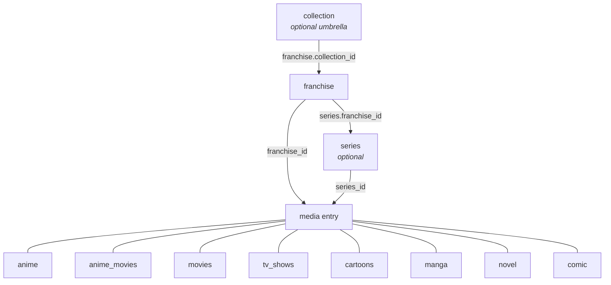

# Data Model

Last verified: 2026-09-12

**What this is for.** This is the reference for every table the app stores, as
declared by the SQLAlchemy models in `app/models/*.py`. It tells you what each
table is for, what each column holds, which constraints the database enforces,
and how tables point at each other - including the tables that point at
"any media entry" without a foreign key. It replaces the older
`data-model.md`, which had drifted from the code (see
[Corrections to the old schema doc](#corrections-to-the-old-schema-doc)).
Enum values are **not** repeated here: every closed vocabulary lives in
[`options.md`](options.md), and what each media type is for lives in
[`entry-types.md`](entry-types.md).

## Table of contents

- [The hierarchy](#the-hierarchy)
- [Conventions shared by every table](#conventions-shared-by-every-table)
- [Grouping tiers](#grouping-tiers): collection, franchise, series
- [Media entries](#media-entries): anime, anime_movies, movies, tv_shows, cartoons, manga, novel, novel_unit, comic, games, game_copy
- [Virtual fields on media entries](#virtual-fields-on-media-entries)
- [Personal data](#personal-data): user_media_list, user_novel_unit_rating
- [People, studios and links](#people-studios-and-links): person, person_role, studio, publisher, publisher_scope, character, character_casting, media_credit, media_tag
- [Where an entry can be watched or read](#media_source): media_source
- [Notes, quotes and memes](#notes-quotes-and-memes): note, quote, meme
- [Relations and watch orders](#relations-and-watch-orders): media_relation, watch_order_list, watch_order_section, watch_order_item
- [Planning](#planning): plan_next
- [Vocabulary and configuration](#vocabulary-and-configuration): system_option, system_option_scope, system_option_usage, system_option_alias, system_configs, seasonal
- [Access control](#access-control): role, role_permission, users, content_label, media_content_label, access_mode, access_mode_label, access_mode_field_group, user_access_mode, user_access_mode_denial
- [Logs](#logs): data_control_logs, deleted_record
- [The `media` supertable](#the-media-supertable)
- [Cross-table references without foreign keys](#cross-table-references-without-foreign-keys)
- [Corrections to the old schema doc](#corrections-to-the-old-schema-doc)

---

## The hierarchy

Media is organised in three grouping tiers above the individual entries.
Only Franchise is mandatory in practice (the hierarchy resolver auto-creates
one when an entry names none - see `app/services/domain/hierarchy.py`);
Collection and Series are optional.

Every entry carries a `franchise_id`. Every entry **except anime_movies** also
carries a `series_id`:

| Entry table    | `franchise_id` | `series_id` | Notes |
|----------------|:--------------:|:-----------:|-------|
| `anime`        | yes | yes | |
| `anime_movies` | yes | **no** | A series-owned watch order can therefore never contain an anime movie. |
| `movies`       | yes | yes | |
| `tv_shows`     | yes | yes | |
| `cartoons`     | yes | yes | |
| `manga`        | yes | yes | |
| `novel`        | yes | yes | |
| `comic`        | yes | yes | |

Media entries never reference a Collection directly - they reach it only through
`franchise.collection_id`. All three parent FKs are `ON DELETE SET NULL`, so
deleting a group leaves its members in place and simply ungrouped.

---

## Conventions shared by every table

- **Primary key.** Every content table uses `system_id UUID` (generated by
  `uuid.uuid4`, indexed). The exceptions are link/log tables with an
  auto-increment `id INTEGER` (`system_option_scope`, `system_configs`,
  `role_permission`, `data_control_logs`, `deleted_record`, `person_role`),
  `users.id` (UUID, named `id`), and `seasonal`, whose primary key is the pair
  `(user_id, seasonal)` - one row per user per season string.
- **Public id.** Every entity with a detail page - the nine media tables plus
  `collection`, `franchise`, `series`, `person`, `studio`, `publisher`,
  `character` and `watch_order_list`, seventeen in all - also carries
  `public_id INTEGER NOT NULL UNIQUE`, fed by a per-table sequence
  (`<table>_public_id_seq`) declared on the model, so every insert path gets
  one for free. It is the **only id a user ever sees**: detail-page URLs are
  `/<type>/<public_id>/<slug>`, while `system_id` stays the join key and the
  id every other endpoint speaks. It rides in the Google Sheet, so the company
  and home databases agree on it - see
  [switching-environments.md](switching-environments.md).

  Its unique constraint is **`DEFERRABLE INITIALLY DEFERRED`** (migration
  `pdf1e2r3d4e5`). Pull restores a whole tab in one transaction and upserts by
  `system_id`, so a row arriving from the sheet routinely carries a
  `public_id` that a *different* local row still holds until the restore
  reaches it. Only the end state has to be unique; an immediately-checked
  constraint would abort the restore partway through. The constraint is not
  weakened - a genuine duplicate still fails, at COMMIT rather than at the
  statement.
- **Timestamps.** `created_at` / `updated_at` are `DateTime`, populated by
  the Python default `get_taipei_now` (Asia/Taipei wall clock), with
  `onupdate` on `updated_at`. They are declared **nullable** on every model -
  there is no NOT NULL and no server default, so a row inserted outside the
  ORM can carry NULLs.
- **Column order = sheet order.** The Google Sheets Backup formatter
  (`format_model_for_sheet` in `app/utils/formatter.py`) walks
  `__table__.columns` in declaration order, so the order of columns in a
  model class **is** the column order of that table's worksheet. Several
  models declare a column in an odd-looking position for exactly this
  reason (e.g. `franchise.collection_id` sits mid-class "so this position is
  the Franchise sheet's column J"). Do not reorder columns casually. The
  worksheet list itself is `SHEET_TABS` in `app/services/pipelines/tabs.py`.
- **Release dates are strings.** Every release/end date is a `String` in
  truncated ISO form - `YYYY`, `YYYY-MM` or `YYYY-MM-DD` - enforced by a
  `CHECK` constraint named `ck_<table>_<column>_iso` using the regex
  `^\d{4}(-\d{2}(-\d{2})?)?$`. The single owner of this format is
  `app/utils/release_date.py`; `DATE_COLUMNS` there lists every such column
  per table, and `RELEASE_PRIORITY` says which one represents an entry for
  sorting (see [options.md - Fixed constants](options.md#fixed-constants)).
- **Names and `NameFallbackMixin`.** Every grouping tier and media entry
  mixes in `NameFallbackMixin` (`app/models/base.py`). Each declares
  `_name_fields`, the list of its name columns, and a `display_name`
  property that returns the first non-empty name in a fixed language order
  (CN → EN → Alt → roman → JP for every type except `comic`, which leads with
  EN). `get_all_names()` returns the lower-cased set of all non-empty names
  and is what duplicate detection compares. **There is no database
  constraint requiring at least one name** - all name columns are nullable
  and a nameless row is legal at the DB level.
- **No DB enums.** Vocabulary columns (`watching_status`, `relation_type`,
  `plan_next.kind`, `media_credit.role`, ...) are plain `String`s validated
  in the API layer against the registries in [`options.md`](options.md), so
  adding a value never needs a migration.
- **`remark` is virtual on eleven tables** - see
  [Virtual fields](#virtual-fields-on-media-entries).

---

## Grouping tiers

### `collection`

Optional umbrella above Franchise: several distinct franchises sharing an IP
or creator ("Marvel" over MCU / X-Men / Spider-Man; "Type-Moon" over Fate /
Tsukihime). Deliberately inert - no derivation, no duplicate detection, no
stats. Model: `Collection` (`app/models/collection.py`).

| Column | Type | Null | Default | Description |
|---|---|:-:|---|---|
| `system_id` | UUID | no | uuid4 | PK |
| `collection_name_en` | String | yes | | |
| `collection_name_cn` | String | yes | | Leads `display_name` |
| `collection_name_roman` | String | yes | | |
| `collection_name_jp` | String | yes | | |
| `collection_name_alt` | String | yes | | |
| `my_rating` | String | yes | | One of MY_RATINGS |
| `collection_expectation` | String | yes | `"Low"` | One of FRANCHISE_EXPECTATIONS |
| `cover_franchise_id` | UUID | yes | | FK `franchise.system_id` ON DELETE SET NULL. The cover is chosen by pointing at one member franchise; the image is resolved through that franchise's cover logic. Declared with `use_alter` (constraint `fk_collection_cover_franchise_id`) to break the collection ↔ franchise FK cycle. |
| `no_built_in_orders` | Boolean | yes | `False` | Suppresses the generated Release Order for umbrellas like 迪士尼 that group unrelated standalone works. |
| `created_at` / `updated_at` | DateTime | yes | now | |

Relationships: `franchises` (Franchise.collection_id), `cover_franchise`.
Virtual: `remark`, `display_name`.

### `franchise`

Top-level grouping. Every media entry belongs to one (auto-created when
missing). Model: `Franchise` (`app/models/franchise.py`).

| Column | Type | Null | Default | Description |
|---|---|:-:|---|---|
| `system_id` | UUID | no | uuid4 | PK |
| `franchise_type` | String | yes | | One of FRANCHISE_TYPES / `FranchiseType` (the two lists differ - see [options.md](options.md#franchise-type)). May hold a comma-separated list; duplicate detection buckets under each token. |
| `franchise_name_en` / `_cn` / `_roman` / `_jp` / `_alt` | String | yes | | Name variants; CN leads `display_name`. |
| `my_rating` | String | yes | | MY_RATINGS |
| `franchise_expectation` | String | yes | `"Low"` | FRANCHISE_EXPECTATIONS |
| `collection_id` | UUID | yes | | FK `collection.system_id` ON DELETE SET NULL, indexed. Declared here (not at the end) so it lands as sheet column J. |
| `cover_entry_id` | UUID | yes | | Any entry UUID of any type; no FK (six tables). |
| `type_covers` | JSONB | yes | | Per-media-type cover choice (dict). |
| `type_slots` | JSONB | yes | | Per-media-type slot layout (dict). |
| `size_group_derived` | JSONB | yes | | Size bucket per media type, e.g. `{"anime": "24ep", "tv-show": "2season"}`. Written by Calculate, rewritten freely. |
| `size_group_manual` | JSONB | yes | | Same shape, written by the admin, never touched by Calculate. Manual key wins (`app/services/domain/size_group.py`). |
| `created_at` / `updated_at` | DateTime | yes | now | |

Relationships: `series`, `collection`, `animes`. Virtual: `remark`,
`display_name`.

### `series`

Intermediate grouping between a franchise and its entries. Mirrors
Franchise's shape without a type or a collection; a series is **never
auto-created** (a franchise is just the top of the tree, a series is a
deliberate grouping). Model: `Series` (`app/models/franchise.py`).

| Column | Type | Null | Default | Description |
|---|---|:-:|---|---|
| `system_id` | UUID | no | uuid4 | PK |
| `franchise_id` | UUID | yes | | FK `franchise.system_id` ON DELETE SET NULL |
| `series_name_en` / `_cn` / `_roman` / `_jp` / `_alt` | String | yes | | The hierarchy resolver looks a series up by `en`, `cn` and `alt` only (`SERIES_NAME_COLUMNS`). |
| `my_rating` | String | yes | | MY_RATINGS |
| `series_expectation` | String | yes | `"Low"` | FRANCHISE_EXPECTATIONS |
| `cover_entry_id` | UUID | yes | | Any entry UUID, any type; no FK. |
| `size_group_derived` / `size_group_manual` | JSONB | yes | | As on franchise. |
| `created_at` / `updated_at` | DateTime | yes | now | |

Relationships: `franchise`, `animes`. Virtual: `remark`, `display_name`,
`names_dict`.

---

## Media entries

Columns common to all nine entry tables (listed once here). Each table also
carries a constant `media_type` discriminator, the child half of its composite
FK up to [the `media` supertable](#the-media-supertable).

| Column | Type | Null | Default | Description |
|---|---|:-:|---|---|
| `system_id` | UUID | no | uuid4 | PK, and the FK up to `media` |
| `media_type` | String | no | per table | Constant discriminator, pinned by `ck_<table>_media_type` |
| `created_at` / `updated_at` | DateTime | yes | now | Catalogue timestamps. The list row has its own pair. |

**Four columns are NOT here any more.** `public_id`, `cover_image_file`,
`franchise_id` and `series_id` live on `media` and nowhere else - a value has
one home, so it cannot drift. Entries still expose all four **as attributes**:
each is an `association_proxy` onto the entry's `media_row`, so response
schemas, the cover upload, the hierarchy resolver, the Fill pipeline and the
SPA read and write them exactly as before.

The one thing that changed for callers: **an association proxy cannot be used
as a column expression**, so a query filters through the joined row -
`db.query(Anime).join(Anime.media_row).filter(Media.franchise_id == fid)` -
or, better, queries `media` directly, which answers for every type at once.
`app/routers/_factory.py` does this for `franchise_id` / `series_id` in
`MEDIA_OWNED_FIELDS`, and `media_entity_ref_filter` does it for `public_id`.

`public_id` keeps its per-type numbering: each type still draws from its own
`<table>_public_id_seq`, declared against the metadata now that no column hangs
it, so existing ids and every SPA URL built from one are unchanged.

**The personal columns are NOT here any more either.** Status, rating and
progress moved to [`user_media_list`](#user_media_list): they are one person's
facts, and they sat on a row everybody shares. Entries still expose every one
of them **as attributes** - `attach_list_fields` sets them on the instance for
the acting user before the response schema reads them - so the API's field
names, the SPA and the sheet's own column names are unchanged. An entry the
viewer has no list row for reads back as the type's default status and None
for the rest, which is what the column held for an untouched entry.

The same caveat as the association proxies applies: **a plain attribute cannot
be used as a column expression**, so a list page filtering by status goes
through an OUTER join onto `user_media_list` (`join_list` in
`app/services/domain/user_list.py`), not a column comparison.

Each entry also has its name columns and the virtual
fields in [Virtual fields](#virtual-fields-on-media-entries). There is no
`source_other` column any more - a `media_source` `bucket='other'` row is
what every read and write path uses now (see [`media_source`](#media_source)).
Credits
(studio, publisher, director, author...) and vocabulary tags (genre, label...)
are
**not columns** - they are rows in `media_credit` / `media_tag`.

### `anime`

TV anime, ONA/OVA/OAD/specials, and anime with `airing_type = "Movie"` that
are tracked as part of a season run. Not the same table as `anime_movies`.
Model: `Anime`. CHECK: `ck_anime_release_date_iso`.

| Column | Type | Null | Default | Description |
|---|---|:-:|---|---|
| `anime_name_en` / `_cn` / `_roman` / `_jp` / `_alt` | String | yes | | |
| `season_part` | String | yes | | "Season 2", "Part 1", "Cour 2"... parsed by `SEASON_PATTERN` / `PART_PATTERN`; part of the duplicate key. |
| `airing_type` | String | yes | | ANIME_AIRING_TYPES |
| `airing_status` | String | yes | | AiringStatus |
| `is_main` | String | yes | | IS_MAIN (本傳/外傳/...) |
| `is_main_entry` | Boolean | yes | | Marks the representative entry of its group. |
| `ep_previous` | Integer | yes | | Episodes accumulated by prequels; **derived** by `derive_ep_previous_all_anime` after Fill/Replace. |
| `ep_total` | Integer | yes | | |
| `ep_special` | Float | yes | | The episode number a special sits at (0, 14.5) - a position, not a count. Part of the duplicate key. |
| `mal_rating` | Float | yes | | From Tenrai |
| `mal_rank` | String | yes | | From Tenrai |
| `anilist_rating` | String | yes | | |
| `release_season` | String | yes | | e.g. `WIN 2024` (RELEASE_SEASONS) - drives `seasonal` |
| `release_date` | String | yes | | ISO date string |
| `broadcast_day` | String | yes | | WEEKDAYS |
| `broadcast_time` | Time | yes | | Postgres TIME, exchanged as `"HH:MM:SS"` |
| `mal_id` | Integer | yes | | Derived from `mal_link` by `apply_extract_mal_id_anime` |
| `mal_link` | String | yes | | |
| `seiyuu` | String | yes | | SEIYUU_STATUSES - a Need/Done work-status flag, **not** a cast list |

Relationships: `franchise`, `series`. Virtual: `remark`, `watch_next`,
`cum_ep_fin`, `cum_ep_total`, `display_name`, `names_dict`, credit/tag link
fields.

### `anime_movies`

Standalone anime films (sheet tab "Anime Movie"). Has **no** `series_id`.
Model: `AnimeMovies`. CHECKs: `ck_anime_movies_release_date_jp_iso`,
`ck_anime_movies_release_date_tw_iso`.

| Column | Type | Null | Default | Description |
|---|---|:-:|---|---|
| `anime_movie_name_en` / `_cn` / `_roman` / `_jp` / `_alt` | String | yes | | |
| `airing_status` | String | yes | | AiringStatus |
| `mal_rating` | Float | yes | | |
| `mal_rank` / `anilist_rating` | String | yes | | |
| `length_min` | Integer | yes | | Runtime in minutes |
| `release_date_jp` | String | yes | | Preferred release date (RELEASE_PRIORITY) |
| `release_date_tw` | String | yes | | |
| `mal_id` | Integer | yes | | |
| `mal_link` | String | yes | | |

Virtual: `remark`, `watch_next`, `to_rewatch`, `display_name`, `names_dict`,
credit/tag link fields - including `distributor_tw`, the one genuinely new
column the publisher migration added: anime_movies never carried a distributor
before, and it takes anime's header because the two tabs record the same fact.

### `movies`

Live-action and animated (non-anime) films. Model: `Movies`. CHECKs:
`ck_movies_release_date_usa_iso`, `ck_movies_release_date_tw_iso`.

| Column | Type | Null | Default | Description |
|---|---|:-:|---|---|
| `movie_name_en` / `_cn` / `_alt` | String | yes | | Three names only |
| `airing_status` | String | yes | | |
| `imdb_rating` | String | yes | | From OMDb |
| `movie_type` | String | yes | | MOVIE_TYPES (`Reality` / `Animation`) |
| `is_main` | String | yes | | IS_MAIN |
| `length_min` | Integer | yes | | |
| `release_date_usa` | String | yes | | |
| `release_date_tw` | String | yes | | Preferred for sorting (RELEASE_PRIORITY: tw, then usa) |
| `imdb_id` | String | yes | | Derived from `imdb_link` |
| `imdb_link` | String | yes | | |

Virtual: `remark`, `watch_next`, `to_rewatch`, `display_name`, `director`,
`original_source` (tag link fields; `original_source` has no
`LEGACY_SHEET_COLUMN` entry for `movie`, so its response attribute is the
field key itself - see the response-attribute note under
[Virtual fields](#virtual-fields-on-media-entries)) and `sources`.

### `tv_shows`

Live-action / scripted TV. Model: `TVShows`. CHECK: `ck_tv_shows_release_date_iso`.

| Column | Type | Null | Default | Description |
|---|---|:-:|---|---|
| `tv_name_en` / `_cn` / `_alt` | String | yes | | |
| `region` | String | yes | | TV_REGIONS |
| `season_part` | String | yes | | |
| `airing_status` | String | yes | | |
| `is_main` | String | yes | | |
| `ep_total` | Integer | yes | | |
| `imdb_rating` | String | yes | | |
| `release_date` | String | yes | | |
| `imdb_id` / `imdb_link` | String | yes | | |

Virtual: `remark`, `watch_next`, `to_rewatch`, `display_name`,
`source_official` (the response attribute for the `original_source` tag
field - `tv-show` kept its pre-rename sheet header, see the response-attribute
note under [Virtual fields](#virtual-fields-on-media-entries)).

### `cartoons`

Western animation. Model: `Cartoon`. CHECK: `ck_cartoons_release_date_iso`.

| Column | Type | Null | Default | Description |
|---|---|:-:|---|---|
| `cartoon_name_en` / `_cn` / `_alt` | String | yes | | |
| `season_part` | String | yes | | |
| `airing_type` | String | yes | | CARTOON_AIRING_TYPES. Fill/Replace only touch `TV` and `Movie`. |
| `airing_status` | String | yes | | |
| `is_main` | String | yes | | |
| `ep_total` | Integer | yes | | |
| `length_ep_min` | Integer | yes | | Minutes per episode |
| `imdb_rating` | String | yes | | |
| `release_date` | String | yes | | |
| `imdb_id` / `imdb_link` | String | yes | | |

Virtual: `remark`, `watch_next`, `display_name`, `source_official` (the
response attribute for the `original_source` tag field - `cartoon` also kept
its pre-rename sheet header).

### `manga`

Manga, manhwa, manhua. Model: `Manga`. CHECKs: `ck_manga_release_date_iso`,
`ck_manga_end_date_iso`.

| Column | Type | Null | Default | Description |
|---|---|:-:|---|---|
| `manga_name_en` / `_cn` / `_roman` / `_jp` / `_alt` | String | yes | | |
| `region` | String | yes | | MANGA_REGIONS |
| `is_main` | String | yes | | |
| `serialization_status` | String | yes | | MANGA_SERIALIZATION_STATUSES |
| `vol_total` | Integer | yes | | |
| `ch_total` | Integer | yes | | |
| `mal_rating` | Float | yes | | |
| `mal_rank` / `anilist_rating` | String | yes | | |
| `release_date` / `end_date` | String | yes | | |
| `anime_studio` | String | yes | | Studio of the anime adaptation (plain text) |
| `mal_id` | Integer | yes | | Derived from `mal_link` (`MAL_MANGA_ID_PATTERN`) |
| `mal_link` / `anilist_link` | String | yes | | |

Virtual: `remark`, `read_next`, `to_reread`, `display_name`,
`author_plot` / `author_draw` / `publisher_tw` / `serialization_platform`
link fields. `serialization_platform` was a real column until Task 11 of the
media-sources migration backfilled it into `media_tag` and dropped it - it is
now a `TagField` shared with `novel` (`app/utils/credit_roles.py`).
`publisher_tw` is the response/sheet attribute name only: since the publisher
migration the value behind it is a `publisher` **credit**, not a tag - the
header did not move, what sits behind it did.

### `novel`

Light novels, web novels, books. Model: `Novel`. CHECKs:
`ck_novel_release_date_iso`, `ck_novel_end_date_iso`. Progress counts are
**Float** so half-volumes can be recorded. `novel_name_each_cn` /
`novel_name_each_en` (the two parallel per-volume JSONB lists) are gone -
replaced by `novel_unit` rows, one per volume/arc/story/chapter, migrated by
Alembic revision `nv1u2n3i4t5s`.

| Column | Type | Null | Default | Description |
|---|---|:-:|---|---|
| `novel_name_en` / `_cn` / `_roman` / `_jp` / `_alt` | String | yes | | |
| `region` | String | yes | | NOVEL_REGIONS |
| `type` | String | yes | | NOVEL_TYPES (Light Novel / Novel / Web / Other); also selects which `novel_unit.unit_kind`s the editor offers - see `entry-types.md` |
| `version` | String | yes | | Edition (free text) |
| `is_main` | String | yes | | |
| `serialization_status` | String | yes | | NOVEL_SERIALIZATION_STATUSES |
| `vol_total_original` | Float | yes | | Volumes in the original run (JP/KR). Not derived - `novel_unit` volume rows are optional enrichment and never feed this column (Decision B, see business-rules.md) |
| `vol_total_tw` | Float | yes | | Volumes published in Taiwan. Same rule: never derived from `novel_unit` rows |
| `arc_total` | Float | yes | | **Derived**: count of the novel's `novel_unit` rows with `unit_kind = 'arc'`, recomputed on every create/update/patch (`derive_novel_progress`, called unconditionally by the router). Still a stored column - null on a novel with no arc rows, and null on every volume-only type (see below) |
| `ch_total` | Float | yes | | **Derived**: sum of `ch_count` over the novel's arc rows; null on every volume-only type |
| `mal_rating` | Float | yes | | |
| `mal_rank` / `anilist_rating` | String | yes | | |
| `release_date` / `end_date` | String | yes | | |
| `is_main_entry` | Boolean | yes | | |
| `read_order` | Float | yes | | Manual ordering within the group |
| `mal_id` | Integer | yes | | |
| `mal_link` / `anilist_link` | String | yes | | |
| `openlibrary_id` | String | yes | | Open Library work id (`"OL5738148W"`). **String**, unlike `comicvine_id`'s `Integer` - the trailing letter distinguishes a work (`OL…W`) from an edition (`OL…M`) or an author (`OL…A`), which a bare integer would discard |
| `openlibrary_link` | String | yes | | The pasted Open Library work URL; `openlibrary_id` is derived from it |

Virtual: `remark`, `read_next`, `to_reread`, `display_name`,
`author` / `illustrator` / `publisher_tw` / `serialization_platform` link
fields (`publisher_tw` is the header a `publisher` credit is written under -
see manga above), `units`
(`List[NovelUnitResponse]`, populated via `selectinload`).

### `novel_unit`

One volume, arc, story or chapter belonging to exactly one `novel`. Model:
`NovelUnit`. Replaces the two parallel `novel_name_each_cn` /
`novel_name_each_en` JSONB lists, which could drift out of alignment because
they were matched by list position and nothing else - one row now holds both
languages. CHECKs: `ck_novel_unit_kind` (`unit_kind` in
`volume, arc, story, chapter`), `ck_novel_unit_ch_count_arc_only`
(`ch_count` is non-NULL only when `unit_kind = 'arc'`). Index
`ix_novel_unit_novel_kind_position` on `(novel_id, unit_kind, position)`.

| Column | Type | Null | Default | Description |
|---|---|:-:|---|---|
| `system_id` | UUID | no | uuid4 | PK |
| `novel_id` | UUID | no | | FK `novel.system_id` ON DELETE CASCADE |
| `unit_kind` | String | no | | `volume`, `arc`, `story` or `chapter` - see NOVEL_UNIT_KINDS_BY_TYPE in options.md |
| `position` | Float | no | | Order within the novel. **Not unique** - the editor reorders by swapping two rows' positions, and a unique constraint would fire mid-swap |
| `unit_key` | String | yes | | Explicit label (e.g. a volume subtitle's short code). When blank, the display key falls back to `"{prefix} {position}"` (`unit_display_key` / `unitDisplayKey`) |
| `name_cn` / `name_en` | String | yes | | |
| `remark` | String | yes | | |
| `ch_count` | Float | yes | | Chapters in this arc. Meaningful only on `unit_kind = 'arc'` rows (guarded by the CHECK); the sole source of `novel.ch_total` and `novel.ch_fin` |
| `created_at` / `updated_at` | DateTime | yes | now | |

Written through `POST`/`PUT /api/novel` via the `units` payload key (popped
out before the row is built, see `MediaTypeSpec.nested_collections`);
reconciled by `write_novel_units` (rows with a `system_id` are updated, rows
without are inserted, rows the payload omits are deleted). `PATCH` cannot
touch `units` - it is not a real column, so `apply_column_patch` silently
ignores it. Every create/update/patch write runs `derive_novel_progress`,
which recomputes `arc_total`/`ch_total`/`ch_fin` from the arc rows and
normalises `arc_fin`/`ch_fin_in_arc` - see business-rules.md.

`derive_novel_progress` reads `type` first. On a **volume-only type** - one
whose only allowed `unit_kind` is `volume`, i.e. `Light Novel` and `Novel`
(`NOVEL_VOLUME_ONLY_TYPES` in `app/utils/constants.py`) - it derives nothing
and instead blanks all five chapter and arc columns: `arc_total` and
`ch_total` to null, `arc_fin`, `ch_fin` and `ch_fin_in_arc` to `0`. The volume
columns are untouched. This holds on every write path, so a chapter value
cannot re-enter from a sheet Pull or a Fill. Migration `v1o2l3o4n5l6` cleared
the historical values once and deleted any non-`volume` `novel_unit` rows
belonging to these types; its downgrade is a deliberate no-op, because nothing
else in the schema records what those values were.

A unit's `my_rating` is NOT a column here: it is one reader's grade of
one volume or arc and lives in
[`user_novel_unit_rating`](#user_novel_unit_rating). It is still served
and accepted as `my_rating` on each unit of a novel's response.

### `comic`

Western comic runs, Marvel-focused; one row is one numbered run. Model:
`Comic`. CHECKs: `ck_comic_release_date_iso`, `ck_comic_end_date_iso`.
`display_name` leads with **EN** (Western comics are known by their English
titles).

| Column | Type | Null | Default | Description |
|---|---|:-:|---|---|
| `comic_name_en` / `_cn` / `_alt` | String | yes | | |
| `volume_label` | String | yes | | Run designator: "Vol. 5", "(2018)", "Legacy". Free text - Marvel run labels are not consistently numbered. |
| `comic_type` | String | yes | | COMIC_TYPES (Ongoing / Limited / One-Shot / Annual) |
| `is_main_entry` | Boolean | yes | | Part of the duplicate key (comic has no `is_main` string) |
| `release_date` / `end_date` | String | yes | | |
| `issue_total` | Integer | yes | | Also the entry's own size-bucket measure |
| `serialization_status` | String | yes | | Same idiom as manga/novel; no dedicated tuple in `constants.py` |
| `read_order` | Float | yes | | |
| `comicvine_id` | Integer | yes | | Derived from `comicvine_link`; what Fill fetches on and what duplicate detection treats as conclusive |
| `comicvine_link` | String | yes | | |

Virtual: `remark`, `read_next`, `to_reread`, `display_name`,
`writer` / `artist` / `publisher` / `imprint` / `continuity` / `era` /
`events` link fields. `publisher` is now a credit rather than the retired
`comic_publisher` tag, under the same header; comic's unused `publisher_tw`
attribute is gone.

### `games`

One **purchasable**, not one work: a base game, a DLC, an expansion or a
bundle. That is how a collection is actually acquired - a DLC is bought,
played and finished separately from its base game - so a DLC is a row in this
same table carrying a `base_game_id`, not a row in a second table. Model:
`Game` (`app/models/game.py`). Note the plural table name, `games`, unlike
`manga` / `novel` / `comic`.

| Column | Type | Null | Default | Description |
|---|---|:-:|---|---|
| `game_name_en` / `_cn` / `_roman` / `_jp` / `_alt` | String | yes | | `display_name` order CN -> EN -> Alt -> Roman -> JP |
| `game_type` | String | yes | | GAME_TYPES (Base Game / DLC / Expansion / Bundle) |
| `base_game_id` | UUID | yes | | Self-FK `games.system_id` ON DELETE **SET NULL** - deleting a base game must not delete the DLC rows bought separately. Deliberately nullable even for a DLC: a DLC is often entered before its base game exists, and a link filled in later beats a write that fails on entry order. |
| `completion_level` | String | yes | | COMPLETION_LEVELS (Main Story / Main + Extras / Post-game / Completionist). Independent of `playing_status`. |
| `all_endings` | Boolean | yes | | Tristate, orthogonal to `completion_level` |
| `all_achievements` | Boolean | yes | | Tristate. **Stored, never derived** from the counts below - a game often publishes no achievement list to count against |
| `all_collected` | Boolean | yes | | Tristate: every in-game collectible found |
| `steam_progress_sync` | Boolean | yes | | Tristate, built as a straight copy of `all_achievements`. `NULL`/`true` = Steam is the authority for `hours_played` and `achievements_earned`; `false` blocks Steam from writing either, for a game owned on Steam but played elsewhere. Governs those two columns only - prices and the Metacritic score ignore it entirely. |
| `achievements_earned` / `achievements_total` | Integer | yes | | A count, independent of `all_achievements`. `achievements_earned` is Steam-fillable and overwrite, guarded by `steam_progress_sync` and a zero/unknown check - see [external-apis.md](external-apis.md#steam); `achievements_total` is fill-only. |
| `release_status` | String | yes | | GAME_RELEASE_STATUSES (Rumored / Unreleased / Early Access / Released / Ongoing / Discontinued / Cancelled) |
| `release_date` | String | yes | | Truncated ISO-8601, CHECK `ck_games_release_date_iso` |
| `current_patch` | String | yes | | What is installed, not what changed in it: "1.6.1", "Update 7" |
| `hours_played` | Float | yes | | Steam-fillable, overwrite, guarded by `steam_progress_sync` and a zero/unknown check (minutes ÷ 60 from `GetOwnedGames`) - see [external-apis.md](external-apis.md#steam) |
| `hltb_main` / `hltb_main_extra` / `hltb_completionist` | Float | yes | | The three public time-to-beat tiers, sourced from IGDB (HowLongToBeat publishes no official API) |
| `price_original_us` / `_jp` / `_tw`, `price_current_us` / `_jp` / `_tw` | Numeric(10,2) | yes | | The game's **market** prices. What I paid is per-copy, on `game_copy`. The first `Numeric` columns in the schema. Steam-fillable: `price_original_*` is the undiscounted list price (fill-only), `price_current_*` is overwritten on every run - what a sale moves. |
| `metacritic_score` | Integer | yes | | Metacritic's critic metascore, out of 100. Steam-fillable, overwrite |
| `metacritic_user_score` | Float | yes | | Metacritic's user score, out of 10. A second column rather than a second reading of the first: the two scales differ, and neither is `my_rating` |
| `igdb_id` / `igdb_link` | Integer / String | yes | | The external pair Fill fetches on. `igdb_id` is what Fill runs on and is typed in or set by the IGDB picker; `apply_extract_igdb_id` recovers it only from an `api.igdb.com` link, never from the public slug URL - see [data-actions.md](data-actions.md). |
| `steam_appid` / `steam_link` | Integer / String | yes | | Written by **IGDB**, not by Steam: `map_igdb_to_game_data` reads `external_games` and adopts the pair fill-only, only when the entry has neither, so a hand-typed `steam_link` is never paired with IGDB's appid for a different edition. `apply_extract_steam_appid` also recovers `steam_appid` from a hand-typed `steam_link` (`store.steampowered.com/app/<id>`), the same way `apply_extract_igdb_id` does for `igdb_link` - see [business-rules.md](business-rules.md) section 2. Steam itself only ever *reads* `steam_appid`; it never writes either column. |

CHECKs beyond the date one: `ck_games_base_no_parent`
(`game_type <> 'Base Game' OR base_game_id IS NULL`) and
`ck_games_not_self_parent` (`base_game_id <> system_id`).

Virtual: `remark`, `play_next`, `to_replay`, `display_name`, `copies`,
`ownership` (see `game_copy`), and the `studio` / `publisher` / `director` /
`composer` / `game_genre` / `game_theme` / `game_mode` / `combat_mode` /
`game_platform` / `label` link fields.

### `game_copy`

One purchase - or wish, or subscription entitlement - of one game. Model:
`GameCopy` (`app/models/game_copy.py`).

Deliberately **not** a `media_source` row. "Where can I watch this" and "which
storefront do I own this on" look alike at one field, but a copy carries six
more (ownership, format, acquisition, price paid, currency, date) and at that
size it is a purchase record, not a source. Putting it on `media_source` would
mean six columns meaning nothing for the other eight media types. And
`game_id` is a real foreign key rather than the polymorphic `(media_type,
entry_id)` pair the other child tables use, because a DLC is itself a `games`
row, so one FK covers game and DLC purchases identically.

| Column | Type | Null | Default | Description |
|---|---|:-:|---|---|
| `system_id` | UUID | no | uuid4 | PK |
| `game_id` | UUID | **no** | | FK `games.system_id` ON DELETE CASCADE, indexed (`ix_game_copy_game`) |
| `user_id` | UUID | **no** | | FK `users.id` ON DELETE CASCADE, indexed (`ix_game_copy_user`). Whose purchase this is. A copy is a purchase record, not a fact about the game, so two people own two rows for the same edition - and `uq_game_copy_row` leads with this column. |
| `storefront` | String | yes | | GAME_STOREFRONTS |
| `ownership` | String | yes | | GAME_OWNERSHIP_KINDS (Owned / Wishlist / Subscription / Free / Not Owned) |
| `copy_format` | String | yes | | GAME_COPY_FORMATS (Digital / Physical) |
| `acquisition` | String | yes | | GAME_ACQUISITION_KINDS (Bought / Gifted / Free / Bundled / Subscription) |
| `price_paid` | Numeric(10,2) | yes | | What **I** paid |
| `price_currency` | String | yes | | |
| `acquired_date` | String | yes | | Truncated ISO-8601, CHECK `ck_game_copy_acquired_date_iso` |
| `remark` | String | yes | | A plain column here, not a `note` row |
| `position` | Integer | **no** | `0` (server default too) | Order within the game |
| `created_at` | DateTime | yes | now | No `updated_at` |

Constraint: `uq_game_copy_row` UNIQUE (`game_id`, `storefront`,
`copy_format`) - one game can be Digital-on-Steam and Physical-on-Switch
without colliding, but the same edition cannot be bought twice on the same
store.

A game's **ownership is derived from these rows and stored nowhere**:
`derive_game_ownership` (`app/services/domain/game_copies.py`) returns the
first of Owned -> Subscription -> Free -> Wishlist -> Not Owned that any copy
carries, and `None` when there are no copies. The rows are written as a
nested collection by `write_game_copies`, on the `write_novel_units` contract:
a row with a `system_id` is updated, one without is inserted, one the payload
omits is deleted; `copies=None` means "not supplied", `copies=[]` means
"clear them".

---

## Virtual fields on media entries

These appear in API responses (and, for `remark`, on the ORM instance) but
are not columns on the entry tables.

| Field | Where it comes from | Tables |
|---|---|---|
| `remark` | A **plain attribute**, defaulted to `None` on the class and set per request by `app.services.domain.remark_field.attach_remark`, which reads `note` (`section = 'remark'`) filtered on `note.author_id` - one query per page. Writes go through `upsert_remark`, which finds *this author's* row. **It is not a SQL expression**, so it cannot appear in a `filter` or `order_by` - `find_all_remarks` queries `note` directly for that reason. It must not become a `column_property` again: a scalar subquery cannot know who is asking, and would serve one person's remark to everybody. | all 9 entries + series, franchise, collection |
| `display_name` | `NameFallbackMixin` property, first non-empty name in language order. | all entries and tiers |
| `ownership` | Derived from a game's `game_copy` rows by `derive_game_ownership`; never stored. Declared on `GameResponse` but **not yet populated by any read path** - the list filter `?ownership=` is an EXISTS over `game_copy` and does not need it. | games |
| `copies` | The game's `game_copy` rows, in `position` order, through the ORM relationship; written back through the `copies` payload key (`nested_collections`). | games |
| `names_dict` | `{en, cn, roman, jp, alt}` for hierarchy resolution. | anime, anime_movies, series |
| `cum_ep_fin`, `cum_ep_total` | Pydantic `computed_field` on `AnimeResponse`: `ep_previous + ep_fin` and `ep_previous + ep_total` (None if `ep_total` unknown). | anime |
| `watch_next` / `read_next` / `play_next` | Boolean over `plan_next` (`kind = next`, `scope = entry`). The row's existence is the flag. | all 9 |
| `to_rewatch` / `to_reread` / `to_replay` | Boolean over `plan_next` (`kind = rewatch`, `scope = entry`). Only types with an entry-level rewatch scope have it: **not** anime, **not** cartoon (they rewatch at franchise scope). Mapping: `PLAN_FLAG_FIELDS` in `app/utils/plan_next_kinds.py`. Note that a virtual flag also has to be **declared on the response schema** - the router factory sets it, but pydantic drops an undeclared field silently, which is why `GameBase` names `play_next` / `to_replay` outright. | anime_movies, movies, tv_shows, manga, novel, comic, games |
| Credit / tag link fields (`studio`, `director`, `producer`, `music`, `genre_main`, `genre_sub`, `label`, `distributor_tw`, `source_official` **or** `original_source`, `author_plot`, ...) | Attached at read time by `services.domain.credits.attach_link_fields` from `media_credit` / `media_tag`; the attribute names are the legacy sheet headers in `LEGACY_SHEET_COLUMN` (`app/utils/credit_roles.py`). | per media type - see `TAG_FIELDS` / `CREDIT_ROLES` |
| `studio_refs` | Attached by the same `attach_link_fields` pass, from the same studio credit rows as the `studio` string beside it - `{system_id, display_name}` per studio, so a page can link where the comma-joined string cannot. Gated with `studio` in the Credits field group (`app/services/rbac/field_groups.py`). | anime, anime_movies |
| `publisher_refs` | Attached by the same `attach_link_fields` pass from the entry's `publisher` credit rows - `{system_id, display_name, label}` per publisher, the `studio_refs` idea for the third entity target plus `credit_refs`'s label, because one publisher role reads a different word per media type (`label` carries `credit_label("publisher", media_type)` - 台灣代理商, 台灣出版商, 出版商 or 發行商). Attached only for media types whose `credit_roles_for()` includes `publisher`, derived rather than hand-listed. Gated with `publisher` in the Credits field group. | anime, anime_movies, manga, novel, comic, games |
| `sources` | List of `SourceRef` (`app/schemas/sources.py`), attached at read time from `media_source` by `services.domain.sources.attach_sources`. Bucket-filtered per viewer (`sources_other` / `sources_restricted`) before the response is built - see [authorization.md](authorization.md). | all 9 |
| `User.role` | `column_property` over `role.name` via `users.role_id` (read-only). | users |

**A tag field's response attribute is not always its field key - and the rule
is asymmetric per media type.** `sheet_column_for(media_type, key)` decides
the attribute name: the legacy sheet header from `LEGACY_SHEET_COLUMN` when
one exists for that `(media_type, key)` pair, otherwise the key itself. The
same logical field can therefore surface under two different names depending
on which entry it is read from - `movie.original_source` (no legacy pair, so
the key is used verbatim) versus `tv_show.source_official` and
`cartoon.source_official` (both keep the pre-rename sheet header, because
Task 9 of the media-sources change renamed the field from `source_official`
to `original_source` in code and vocabulary but deliberately left the sheet
header - and therefore the API attribute - unchanged). Meanwhile
`GET /api/credits/{media_type}/{entry_id}` returns tags keyed by the
**canonical** field key (`field_spec.key`) for every media type, with no such
substitution. A frontend page reading a tag off the entry payload and a page
reading the same tag off `/api/credits` must therefore use two different
keys for TV Show and Cartoon's original source. This shipped as a real bug
once already (`TV.jsx`/`Cartoon.jsx` read `original_source`, which is
`undefined` on those two types) before being caught and fixed - see
[api.md](api.md#reading-credits-the-entry-payload-not-this-endpoint).

---

## Personal data

Two tables, and the reason there are two.

`user_media_list` is **one wide, null-heavy table** rather than nine per-type
ones. That was the accepted trade and it is not worth relitigating: nine
tables would mean nine models, nine migrations, nine joins in every list
query, and a `media_type` switch at every call site - to buy column-level
tidiness on a table nobody queries by column. One table means one join, one
service (`app/services/domain/user_list.py`), and `LIST_FIELDS` as the single
place that says which keys a type actually owns. The cost is real: a game row
carries `ch_fin_in_arc` as NULL forever. It is cheaper than the alternative.

`user_novel_unit_rating` exists because a novel *unit* is not a media entry.
`user_media_list` is keyed by `media_id`, so a per-unit rating has nowhere to
sit on it; a two-column join table is the smallest thing that is correct.

### `user_media_list`

One person's relationship with one entry: what they think of it, how far they
got, and when they finished. Model: `UserMediaList`
(`app/models/user_media_list.py`).

Keyed by `(user_id, media_id)` - `uq_user_media`. `media_id` points at the
[`media` supertable](#the-media-supertable), not at a detail table, so one row
shape serves all nine types and a deleted entry takes its list rows with it.

| Column | Type | Null | Default | Description |
|---|---|:-:|---|---|
| `system_id` | UUID | no | uuid4 | PK |
| `user_id` | UUID | **no** | | FK `users.id` ON DELETE CASCADE. Deleting a user removes their whole list and nothing else. |
| `media_id` | UUID | **no** | | FK `media.system_id` ON DELETE CASCADE |
| `status` | String | **no** | per type | The one status column for all nine types. Translated to and from `watching_status` / `reading_status` / `playing_status` by `STATUS_FIELD`; the default comes from `DEFAULT_STATUS`. |
| `my_rating` | String | yes | | MY_RATINGS - a letter grade, never a number |
| `completed_at` | DateTime | yes | | Stamped when the status becomes a completed one (`apply_list_completion_timestamp`) |
| `my_watch_day` | String | yes | | WEEKDAYS. Anime only. |
| `ep_fin` | Float | yes | | anime, tv_shows, cartoons |
| `vol_fin` | Float | yes | | manga, novel. Float because novel counts in halves. |
| `vol_fin_page` | Integer | yes | | manga |
| `ch_fin` | Float | yes | | manga, novel |
| `arc_fin` | Float | yes | | novel |
| `ch_fin_in_arc` | Float | yes | | novel - the two-stage cursor's second stage |
| `progress_display` | String | yes | | novel |
| `issue_fin` | Integer | yes | | comic |
| `created_at` / `updated_at` | DateTime | yes | now | |

**Which keys a type owns** is `LIST_FIELDS`, not this table's shape. A write
naming a key the type does not own is left in the catalogue half deliberately,
so it hits the model and raises the usual unknown-column error instead of
being silently swallowed into a list row where it means nothing.

**Reading zero and never opening it are the same thing.** `vol_fin`,
`vol_fin_page`, `ch_fin`, `arc_fin`, `ch_fin_in_arc` and `issue_fin` were
`NOT NULL DEFAULT 0` on their detail tables and are nullable here, so an entry
with no list row reads them back as `0` (`LIST_FIELD_DEFAULTS`) rather than
None - the value the column always held. `ep_fin` is deliberately excluded: it
was nullable on `anime` / `tv_shows` / `cartoons`, so None is a value it always
could have had.

### `user_novel_unit_rating`

One reader's grade of one novel unit. Model: `UserNovelUnitRating`
(`app/models/user_novel_unit_rating.py`). Keyed by `(user_id, unit_id)` -
`uq_user_novel_unit`.

| Column | Type | Null | Default | Description |
|---|---|:-:|---|---|
| `system_id` | UUID | no | uuid4 | PK |
| `user_id` | UUID | **no** | | FK `users.id` ON DELETE CASCADE |
| `unit_id` | UUID | **no** | | FK `novel_unit.system_id` ON DELETE CASCADE |
| `my_rating` | String | yes | | MY_RATINGS |
| `created_at` / `updated_at` | DateTime | yes | now | |

A null rating stores **no row**: `write_novel_units` deletes an existing one
rather than keeping it holding None, so "never graded" and "graded, then
cleared" do not become two different states. `attach_unit_ratings` puts the
value back on each unit for the reader, one query per page.

## People, studios and links

### `person`

One human credited on a media entry (Tier 3 entity - see
[options.md](options.md#tier-3--entities)). Model: `Person` (`app/models/staff.py`).

| Column | Type | Null | Default | Description |
|---|---|:-:|---|---|
| `system_id` | UUID | no | uuid4 | PK |
| `name_en` | String | yes | | Indexed |
| `name_cn` | String | yes | | |
| `name_jp` | String | yes | | |
| `name_alt` | String | yes | | The slot for a name that is none of the other three. Never chosen automatically. |
| `display_name_field` | String | yes | | `en` / `cn` / `jp` / `alt`, or NULL for the fallback chain |
| `gender` | String | yes | | On the base table, not a seiyuu extension: a fact about the person, not the role. |
| `my_rating` | String | yes | | MY_RATINGS |
| `photo_file` | String | yes | | Storage key under `static/covers/`, `staff/<system_id>.jpg` |
| `remark` | Text | yes | | A real column here (not a note row) |
| `created_at` / `updated_at` | DateTime | yes | now | |

Constraints: `uq_person_name` UNIQUE (`name_en`, `name_cn`, `name_jp`,
`name_alt`) **NULLS NOT DISTINCT** - three of the four are NULL on a typical
row and Postgres treats NULLs as distinct by default, so without this the
constraint is inert; `ck_person_has_a_name` requires at least one name.
Relationship: `roles` (cascade delete-orphan).

Same name shape as `studio`, and for the same reason: a person is known by
whichever names they are known by, and requiring a specific one would force a
made-up value. `display_name` picks `display_name_field`'s column, falling back
en -> cn -> jp -> alt. Which column an automatically created name lands in is
`name_slot_for`'s decision (`app/utils/name_normalize.py`), shared by
`resolve_person` and the reshape migration so a name cannot land in one column
today and another tomorrow. Migration `p7n8a9m10e11` distributed the 554
existing `name_native` values (218 en / 165 cn / 171 jp) and dropped that
column.

### `person_role`

Which dropdowns a person appears in. Explicit rather than derived from
credits, so a director can be offered before their first credit exists.

| Column | Type | Null | Default | Description |
|---|---|:-:|---|---|
| `id` | Integer | no | autoincrement | PK |
| `person_id` | UUID | no | | FK `person.system_id` ON DELETE CASCADE, indexed |
| `role` | String | no | | One of PERSON_ROLES, indexed |
| `scope` | String | **no** | | A hyphenated media-type key, one of `legal_scopes(role)` |

Constraint: `uq_person_role` UNIQUE (`person_id`, `role`, `scope`) - plain, not
NULLS NOT DISTINCT: with `scope` NOT NULL there is no nullable column left in
the key. It *was* needed while scope was NULL for every role but `director`.

A person's dropdown visibility is the **union** of their rows, and there is
deliberately no unscoped "offered everywhere" state - unlike
`system_option_scope`, where zero rows means everywhere. Person credits are
auto-scoped on write, so under an "everywhere" rule the first scope row would
silently narrow the person; with no such state to collapse, auto-scoping is
purely additive. Migration `r0l1c2o3l4p5` rebuilt the table onto the five
collapsed role keys and made `scope` NOT NULL.

### `studio`

One anime production studio, and a public entity with a page of its own.
Publishers and distributors are **not** here - they have their own
[`publisher`](#publisher) table. There is no "Publisher / Distributor TW" or
"Comic Publisher" `system_option` vocabulary: every such value is a
`media_credit` row pointing at a `publisher`.

`studio` deliberately has **no** scope table of its own, unlike
[`publisher`](#publisher_scope). A studio list that offers every studio on
every type it applies to is not wrong in the way a distributor list offering
木棉花 on a game would be.

| Column | Type | Null | Default | Description |
|---|---|:-:|---|---|
| `system_id` | UUID | no | uuid4 | PK |
| `name_en` | String | yes | | Indexed |
| `name_cn` / `name_jp` / `name_alt` | String | yes | | |
| `display_name_field` | String | yes | | `en` / `cn` / `jp` / `alt`, or NULL for the fallback chain |
| `my_rating` | String | yes | | MY_RATINGS |
| `logo_file` | String | yes | | Storage key under `static/covers/`, `studio/<system_id>.jpg`. Filled from MAL's producer logo when `mal_id` is set — see [external-apis.md](external-apis.md#mapping-for-studio--map_tenrai_to_studio_data) |
| `remark` | Text | yes | | |
| `founded_date` / `defunct_date` | String | yes | | Truncated ISO-8601, the format owned by `app/utils/release_date.py` |
| `country` | String | yes | | |
| `website_url` | String | yes | | |
| `mal_id` | Integer | yes | | MAL producer id. Derived from `mal_link` by `extract_mal_id_producer` on write and on Fill, or typed directly. Setting it is what makes a studio fillable |
| `mal_link` | String | yes | | |
| `created_at` / `updated_at` | DateTime | yes | now | |

All four name columns are nullable and **at least one** must be set: a studio
is known by whichever names it is known by, and requiring a specific one would
force a made-up value. Which one is shown is data, not a hard-coded chain -
see [business-rules.md section 10a](business-rules.md#10a-studio-display-names-modelsstaffpy-libnamingjs).

Constraints:

- `uq_studio_name` UNIQUE (`name_en`, `name_cn`, `name_jp`, `name_alt`)
  **NULLS NOT DISTINCT**. Load-bearing: three of the four columns are NULL on
  a typical row, and Postgres treats two NULLs as distinct by default, so
  without it the constraint is inert and two studios with the same
  `name_en` commit cleanly. Same lesson as `uq_person_name` and
  `uq_media_credit_row`.
- `ck_studio_has_a_name` CHECK `num_nonnulls(name_en, name_cn, name_jp,
  name_alt) >= 1`. Mirrored in `StudioBase` (`app/schemas/staff.py`) so a
  nameless studio is a 422 from the API rather than a 500 surfacing the
  database's IntegrityError.
- `ck_studio_founded_date` / `ck_studio_defunct_date` CHECK the value matches
  `^\d{4}(-\d{2}(-\d{2})?)?$` when it is not NULL.

Migration `s1t2u3d4i5o6` reshaped the table: the old required `name_native`
became `name_en` (verified lossless against the 77 production rows - every
value was already a Latin/romanised name), and the profile columns above were
added.

### `publisher`

One publisher or distributor - a games publisher, or a Taiwanese licensor -
and a public entity with a page of its own. Model: `Publisher`
(`app/models/staff.py`).

The `publisher` credit role covers **six** media types: anime, anime-movie,
manga, novel, comic and game. There is no parallel `system_option`
vocabulary - every publisher value is a `media_credit` row pointing here.

Deliberately a separate table rather than a `publisher` role pointing at
`studio`. The overlap is real - Bandai Namco and Kadokawa both develop and
publish, and will exist as two unlinked rows - but the bulk of
publisher/distributor values are distributors (木棉花, 曼迪) that never
developed anything, and putting them on `/library/studio` would make that page
mean something vaguer than it does.

| Column | Type | Null | Default | Description |
|---|---|:-:|---|---|
| `system_id` | UUID | no | uuid4 | PK |
| `name_en` | String | yes | | Indexed |
| `name_cn` / `name_jp` / `name_alt` | String | yes | | |
| `display_name_field` | String | yes | | `en` / `cn` / `jp` / `alt`, or NULL for the fallback chain |
| `my_rating` | String | yes | | MY_RATINGS |
| `logo_file` | String | yes | | Storage key under `static/covers/`, `publisher/<system_id>.jpg`. Never autofilled - there is no MAL producer record for a games publisher or a TW distributor |
| `remark` | Text | yes | | |
| `founded_date` / `defunct_date` | String | yes | | Truncated ISO-8601, the format owned by `app/utils/release_date.py` |
| `country` | String | yes | | |
| `website_url` | String | yes | | |
| `created_at` / `updated_at` | DateTime | yes | now | |

**No `mal_id` / `mal_link` columns**, unlike `studio`. MAL knows nothing about
a games publisher or a Taiwanese distributor, so there is nothing to derive an
id from and nothing to enrich; `app/routers/publisher.py` therefore carries no
autofill call either. `tests/api/test_publisher_model.py` asserts the absence.

`display_name` and `names_dict` behave exactly as on `studio`:
`display_name_field` names the winner and the EN → CN → JP → Alt chain is only
the fallback.

Relationship: `scopes` -> [`publisher_scope`](#publisher_scope) (cascade
`all, delete-orphan`, `passive_deletes=True`), the one place the shape departs
from `studio`.

Constraints:

- `uq_publisher_name` UNIQUE (`name_en`, `name_cn`, `name_jp`, `name_alt`)
  **NULLS NOT DISTINCT** - load-bearing for the same reason as
  `uq_studio_name`: three of the four columns are NULL on a typical row, and
  without it the constraint is inert.
- `ck_publisher_has_a_name` CHECK `num_nonnulls(name_en, name_cn, name_jp,
  name_alt) >= 1`. Mirrored in `PublisherBase` (`app/schemas/publisher.py`) so
  a nameless publisher is a 422, not a 500.
- `ck_publisher_founded_date` / `ck_publisher_defunct_date` CHECK the value
  matches `^\d{4}(-\d{2}(-\d{2})?)?$` when it is not NULL.

### `publisher_scope`

Which media types a publisher is offered on. Model: `PublisherScope`
(`app/models/staff.py`).

Explicit rather than derived from credits, for the reason
[`person_role`](#person_role) already gives: a distributor added today must
appear in the anime picker *before* its first credit exists. Without it every
migrated publisher would be offered on all six types - a games publisher
suggested as an anime distributor, and 木棉花 suggested on a game.

| Column | Type | Null | Default | Description |
|---|---|:-:|---|---|
| `id` | Integer | no | autoincrement | PK |
| `publisher_id` | UUID | no | | FK `publisher.system_id` ON DELETE CASCADE, indexed |
| `scope` | String | **no** | | A hyphenated media-type key, one of `legal_scopes("publisher")` |

Constraint: `uq_publisher_scope` UNIQUE (`publisher_id`, `scope`) - plain, not
NULLS NOT DISTINCT: `scope` is NOT NULL, so no nullable column is left in the
key for Postgres to treat as distinct from itself. `uq_person_role` needed the
opposite treatment only while its own scope column was still nullable.

**No `role` column**, and that is the one deliberate difference from
`person_role`. A person holds several roles, so that table keys on
`(person_id, role, scope)`; a publisher holds exactly one role, `publisher`,
so a column whose value is that constant on every row would encode nothing.

The two rules `person_role` argues for are inherited unchanged:

- **No unscoped "offered everywhere" state.** Zero rows means offered
  *nowhere*, the opposite of `system_option_scope`.
- **Auto-scoping on write is additive.** `resolve_publisher(db, name, *,
  scope=)` adds the media type's row if absent and never removes another, so
  crediting a publisher on a manga can only widen where it is offered. Under
  an "everywhere" rule the first scope row would silently *narrow* the
  publisher - the trap Ruling R27 removed from tags.

`POST /api/publisher` inserts additively for the same reason; `PUT` is a full
replace (the one path an admin uses to take a scope away) and merge unions
both sides' rows. `GET /api/publisher/?scope=<media-type>` is the read filter.

Migration `pb2m3i4g5r8` seeded the table from the data it converted: each
publisher got exactly the scopes of the entries it is credited on. Two values
with no tag rows at all (`bilibili`, `Crunchyroll`) were seeded by hand with
the `anime` scope, because zero rows would have made them invisible in every
picker.

### `character`

One fictional character, shared across every entry they appear in (a Tier 3
entity, paired with `character_casting`). Model: `Character`
(`app/models/character.py`). Shaped like `person` deliberately,
with one intentional deviation - see the constraints note below.

| Column | Type | Null | Default | Description |
|---|---|:-:|---|---|
| `system_id` | UUID | no | uuid4 | PK |
| `name_en` | String | yes | | Indexed |
| `name_cn` | String | yes | | |
| `name_jp` | String | yes | | |
| `name_alt` | String | yes | | |
| `display_name_field` | String | yes | | `en` / `cn` / `jp` / `alt`, or NULL for the fallback chain |
| `gender` | String | yes | | |
| `my_rating` | String | yes | | MY_RATINGS |
| `photo_file` | String | yes | | Storage key under `static/covers/`, `character/<system_id>.jpg`; the canonical portrait. A casting may override it with its own `photo_file` for how the character looked in that entry. |
| `remark` | Text | yes | | |
| `created_at` / `updated_at` | DateTime | yes | now | |

Constraint: `ck_character_has_a_name` CHECK `num_nonnulls(name_en, name_cn,
name_jp, name_alt) >= 1`. **Deliberately no unique constraint on the name
columns**, unlike `uq_person_name` and `uq_studio_name` (Decision G of the
design spec). `uq_person_name` works because a human's full name is nearly
unique; character names are not - "Yuki" and "Ichika" recur across unrelated
works - and under Decision C a character has no owning franchise to scope a
uniqueness rule to, so any such constraint here would refuse legitimate rows.
Duplicates are instead caught by the name-match search the cast editor's
character combobox runs (listing existing matches together with the entries
they already appear in) and fixed afterwards by `POST
/api/character/{id}/merge`. This is why `POST /api/character` is a **plain
create, not find-or-create**: unlike `POST /api/person`, which safely
resolves a normalized-name match because two spellings of one director really
are one human, resolving a character payload against an existing row by name
would silently fuse the "Yuki" of one work with the unrelated "Yuki" of
another - exactly the collision Decision G accepts as normal instead.

### `character_casting`

One character, in one entry, optionally voiced by one person. Model:
`CharacterCasting` (`app/models/character.py`). THE cast record - there is no
second one; no `media_credit` row with `role="seiyuu"` ever exists, because a
seiyuu reaches an anime through the character they voice, and deriving the
entry's seiyuu list from these rows is what keeps "who is in this anime" to a
single answer (Decision A).

| Column | Type | Null | Default | Description |
|---|---|:-:|---|---|
| `system_id` | UUID | no | uuid4 | PK |
| `character_id` | UUID | no | | FK `character.system_id` **ON DELETE CASCADE**, indexed |
| `media_type` | String | no | | Hyphenated key: one of `anime`, `anime-movie`, `manga`, `novel` |
| `entry_id` | UUID | no | | FK-less - see [Cross-table references](#cross-table-references-without-foreign-keys) |
| `person_id` | UUID | yes | | FK `person.system_id` **ON DELETE SET NULL**, indexed |
| `role` | String | yes | | One of `CHARACTER_ROLES` (`Main`, `Supporting`) |
| `position` | Integer | no | `0` (server default too) | Display / drag-reorder order |
| `photo_file` | String | yes | | Storage key under `static/covers/`: this character as she appears in this entry. NULL falls back to `character.photo_file` at read time. |
| `remark` | Text | yes | | |
| `created_at` | DateTime | yes | now | No `updated_at` |

Constraints and indexes:

- `uq_character_casting` UNIQUE (`character_id`, `media_type`, `entry_id`) -
  one casting per character per entry (Decision E: casting is per-entry with
  no default/override split, so a recast is a second row, not a resolution
  rule). No NULLS NOT DISTINCT needed: all three columns are NOT NULL.
- `ck_casting_voice_scope` CHECK `person_id IS NULL OR media_type IN
  ('anime', 'anime-movie')` - characters reach all four ACG types
  (`anime`, `anime-movie`, `manga`, `novel`), but a seiyuu (`person_id` set)
  may only be attached on the two types with voice acting. Enforced in the
  database, not just in `app/services/domain/casting.py`, because the Fill
  pipeline and any future migration write these rows without going through
  the API.
- `ix_character_casting_entry` (`media_type`, `entry_id`) - the cast-list
  query.

**`person_id` is `ON DELETE SET NULL`, unlike `media_credit.person_id`'s `ON
DELETE CASCADE`** (Decision H). A `media_credit` row *is* the person's link to
the work and rightly dies with them; a `character_casting` row is the
*character's* link to the work and merely names a seiyuu, so deleting a
seiyuu must not delete the character from the entry's cast - it survives with
`person_id` NULL. `character_id` remains `ON DELETE CASCADE`: deleting the
character genuinely removes their castings, and `POST
/api/character/{id}/merge` (repoint then delete the loser) is the fix when a
delete would otherwise lose casting history for a duplicate.

`person_role.role` carries no database enum or CHECK, so a new
`PERSON_ROLES` value such as `seiyuu` needs no migration - see
[options.md](options.md) and
[systems/credits-and-tags.md](systems/credits-and-tags.md).

### `media_credit`

One person, studio **or** publisher credited on one media entry. Model:
`MediaCredit` (`app/models/media_credit.py`). This is where every credit
lives; the entry tables carry no credit columns. The target axis is three
columns wide - `person_id`, `studio_id`, `publisher_id` - exactly one of which
is set.

| Column | Type | Null | Default | Description |
|---|---|:-:|---|---|
| `system_id` | UUID | no | uuid4 | PK |
| `media_id` | UUID | no | | FK `media.system_id` ON DELETE CASCADE - see [The six tables that moved to `media_id`](#the-six-tables-that-moved-to-media_id) |
| `role` | String | no | | One of CREDIT_ROLE_KEYS, indexed |
| `person_id` | UUID | yes | | FK `person.system_id` ON DELETE CASCADE |
| `studio_id` | UUID | yes | | FK `studio.system_id` ON DELETE CASCADE |
| `publisher_id` | UUID | yes | | FK `publisher.system_id` ON DELETE CASCADE, indexed |
| `position` | Integer | no | `0` (server default too) | Order the names had in the old comma-joined column |
| `remark` | Text | yes | | |
| `created_at` | DateTime | yes | now | No `updated_at` |

Constraints: `ck_media_credit_one_target` CHECK `num_nonnulls(person_id,
studio_id, publisher_id) = 1` - exactly one target, so a row naming both a
studio and a publisher has no single meaning and is rejected;
`uq_media_credit_row` UNIQUE (`media_id`, `role`, `person_id`, `studio_id`,
`publisher_id`) NULLS NOT DISTINCT - NULLS NOT DISTINCT is load-bearing,
because two of the three target columns are NULL on every row and Postgres
would otherwise let the same person hold the same role on the same entry
twice; index `ix_media_credit_entry` (`media_id`). Migration `p1u2b3l4i5s6` drops and recreates both
the CHECK and the unique constraint to take the third column in.

### `media_tag`

One `system_option` value attached to one media entry. Keyed by **field**
rather than category because one category can back several fields.

| Column | Type | Null | Default | Description |
|---|---|:-:|---|---|
| `system_id` | UUID | no | uuid4 | PK |
| `media_id` | UUID | no | | FK `media.system_id` ON DELETE CASCADE - see [The six tables that moved to `media_id`](#the-six-tables-that-moved-to-media_id) |
| `field` | String | no | | One of TAG_FIELD_KEYS, indexed |
| `option_id` | UUID | no | | FK `system_option.system_id` ON DELETE CASCADE, indexed |
| `position` | Integer | no | `0` | |
| `created_at` | DateTime | yes | now | |

Constraints: `uq_media_tag_row` UNIQUE (`media_id`, `field`, `option_id`);
index `ix_media_tag_entry` (`media_id`).

### `media_source`

Where one entry can be watched, read, or looked up. Shaped like
`media_credit`: one row per named thing attached to an entry, through a real
`media_id` foreign key (see
[The six tables that moved to `media_id`](#the-six-tables-that-moved-to-media_id)).
Model: `MediaSource` (`app/models/media_source.py`).

| Column | Type | Null | Default | Description |
|---|---|:-:|---|---|
| `system_id` | UUID | no | uuid4 | PK, indexed |
| `media_id` | UUID | no | | FK `media.system_id` ON DELETE CASCADE - see [The six tables that moved to `media_id`](#the-six-tables-that-moved-to-media_id) |
| `kind` | String | no | | `access` (somewhere to watch/read) or `reference` (somewhere to read *about* it — a wiki, a database), indexed |
| `bucket` | String | no | | `main` (vocabulary platform, via `option_id`), `other` (free-form, gated by field group `sources_other`), or `restricted` (free-form, gated by `sources_restricted`), indexed |
| `option_id` | UUID | yes | | FK `system_option.system_id` ON DELETE CASCADE, indexed. Set on `main` rows only |
| `name` | String | yes | | Free text. Set on `other` / `restricted` rows only |
| `available` | Boolean | yes | | Tristate — `True` available, `False` not, NULL unknown. Meaningful only on `main` `access` rows; NULL on every `reference` row and every free-form row |
| `url` | String | yes | | |
| `position` | Integer | no | `0` (server default too) | `main` rows render in the pointed-at option's `sort_order` instead and never carry a meaningful `position`; `other`/`restricted` rows render in insertion order via this column |
| `created_at` | DateTime | yes | now | |

Constraints: `ck_media_source_one_target` CHECK `num_nonnulls(option_id, name)
= 1`; `uq_media_source_row` UNIQUE (`media_id`, `kind`, `bucket`, `option_id`,
`name`) NULLS NOT DISTINCT — two free-form rows with the same name on one entry
collide instead of both being stored, since `option_id` is NULL on both and the
default NULL-is-distinct rule would let them through; index
`ix_media_source_entry` (`media_id`).

**Read/write.** `services.domain.sources.attach_sources` sets `entry.sources`
(a list of `SourceRef`, `app/schemas/sources.py`) on every list and detail
response; `replace_sources` rewrites an entry's whole set on
POST/PUT/PATCH via `MediaTypeSpec.nested_collections`, the same seam
`write_novel_units` uses. An entry's rows are removed by the `media_id`
cascade — the hand-written `delete_sources_for` went with it. Bucket filtering
by RBAC happens inside `attach_sources` itself, not in `field_gate.gate()`,
because it is partial — a viewer can hold `other` and not `restricted` — see
[authorization.md](authorization.md).

**Coexists with a few older columns.** `mal_id`/`mal_link`, `imdb_id`/
`imdb_link`, `comicvine_id`/`comicvine_link` and `openlibrary_id`/
`openlibrary_link` stay real columns — the Fill pipeline extracts an id out of
them (`derivation.py`) and gates on their presence (`checking.py`,
`calculation.py`). The guiding rule: **a link the system acts on is a column;
a link that is only ever displayed is a `media_source` row.** The older
entry tables carry **no** per-type source columns — no `source_baha`,
`baha_link`, `source_netflix`, `source_other`, `official_link`,
`twitter_link` or `anilist_link` on any of them. Every source is a row here,
including in the Sheets round trip.

**Sheets.** Backed up and restored as its own tab, `Media Source`, after
`Note` (both endpoints — the entry and, when set, the option — must already
exist). `option_id` is not written to the sheet as a UUID: `system_option`
mints a different id per database, so the tab instead carries the option's
`category` and `value` strings (`option_category`/`option_value`, resolved
back through the local vocabulary on Pull), the same treatment credits and
tags already get. `entry_id` round-trips as a plain UUID because entry ids are
identical across databases. `DERIVED_IDENTITY_KEYS["Media Source"]` is the six
columns of `uq_media_source_row` (including `option_id`, resolved to the
*local* id before the natural-key match runs) — without it, two `main` rows
on one entry for different platforms would both have `name = NULL` and
collide as duplicates on a second Pull. See
[data-actions.md](data-actions.md) for the breaking-change note on this tab.

---

## Notes, quotes and memes

### `note`

One note item - one bullet, one linked resource, one episode comment - on any
owner (entry **or** grouping tier). Replaces the per-table `notes` JSONB blob.
Model: `Note` (`app/models/note.py`). Which columns a row uses is decided by
its section's *shape* in `app/utils/note_sections.py`
(see [options.md - Note sections](options.md#note-sections)).

| Column | Type | Null | Default | Description |
|---|---|:-:|---|---|
| `system_id` | UUID | no | uuid4 | PK |
| `media_id` | UUID | yes | | FK `media.system_id` ON DELETE CASCADE, indexed - set when the owner is one of the nine media types |
| `collection_id` / `franchise_id` / `series_id` | UUID | yes | | FK to the matching tier table, ON DELETE CASCADE, indexed - set when the owner is a grouping tier |
| `author_id` | UUID | **no** | | FK `users.id` ON DELETE CASCADE, indexed. Who wrote the row - see [`note`, `quote` and `meme`: who wrote it](#note-quote-and-meme-who-wrote-it) |
| `section` | String | yes | | Key in NOTE_SECTIONS, indexed |
| `locator` | String | yes | | Where in the work: episode, chapter, scene, timestamp, or a question's source. The section supplies the label and whether it is required. |
| `kind` | String | yes | | Only where the section declares `kinds` |
| `status` | String | yes | | Music tracking status (Need/Pending/Done); `music_track` and `insert_songs` shapes only |
| `title` | String | yes | | Name half of `name_links` / music rows |
| `content` | Text | yes | | Body |
| `links` | JSONB | yes | | List of URL strings, for the seven sections whose shape holds links |
| `entries` | JSONB | yes | | The `name_entries` shape's ordered items - each `{"type": "text" or "link", "value": str, "label": str or null}`. Deliberately not folded into `links`: one column meaning two things is how subtle bugs start. |
| `sort_index` | Float | yes | | Ordering within (owner, section) |
| `created_at` / `updated_at` | DateTime | yes | now | |

`ck_note_one_owner` CHECKs `num_nonnulls(media_id, collection_id,
franchise_id, series_id) = 1`, so exactly one owner is set. **`owner_type` and
`owner_id` are not stored**: four real foreign keys replace the pair so every
owner cascades. Both survive as read-only Python properties derived from
whichever column is set, which is how the API, the SPA and the Note sheet tab
keep the pair's vocabulary. The API's `owner_type` / `owner_id` parameters are
translated onto the columns in `app/routers/note.py`.

Each section also declares a **scope** - `catalog` (shared) or `personal` (one
set per user) - which decides who may write a row and whose rows a read
returns; see [systems/notes.md](systems/notes.md#scope) and
[authorization.md](authorization.md#note-scope).

Indexes: `ix_note_owner_section` (the four owner columns + `section`) - the
notes page's only read path; **`ix_note_one_remark_per_owner`** - partial
UNIQUE over the four owner columns **plus `author_id`**, **NULLS NOT
DISTINCT**, `WHERE section = 'remark'`.

The second is keyed per owner **per author**, because `remark` is a
personal-scope section: two accounts may each hold one on the same entry and
each reads back their own. It pairs with a viewer-aware read path
(`attach_remark`) and the two are one mechanism — narrowing the index back to
per-owner, or reverting the read to a scalar subquery, turns a loud database
refusal into an accepted-then-invisible write.

NULLS NOT DISTINCT is required because three of the four owner columns are
always NULL - and `author_id` is NULL on rows written before accounts existed
- so without it Postgres treats every such row as unique and the index
enforces nothing.

### `quote`

One memorable line from a single media entry (entry-only: a quote is said in
a specific work). Model: `Quote`.

| Column | Type | Null | Default | Description |
|---|---|:-:|---|---|
| `system_id` | UUID | no | uuid4 | PK |
| `media_id` | UUID | yes | | FK `media.system_id` ON DELETE SET NULL - see [The six tables that moved to `media_id`](#the-six-tables-that-moved-to-media_id) |
| `author_id` | UUID | **no** | | FK `users.id` ON DELETE CASCADE, indexed - see [`note`, `quote` and `meme`: who wrote it](#note-quote-and-meme-who-wrote-it) |
| `text` | Text | yes | | |
| `translation` | Text | yes | | |
| `language` | String | yes | | |
| `speaker` | String | yes | | |
| `original_source` | String | yes | | Set when the speaker is themselves quoting something |
| `episode` | String | yes | | Free text: "S2E4", "Ch. 12", "Vol. 3" |
| `link` | String | yes | | |
| `image_file` | String | yes | | Bare filename under `static/quotes/` - a flat directory of its own, not the owner-typed `static/covers/` layout |
| `tags` | JSONB | yes | | |
| `is_general` | Boolean | yes | `False` | Works in any conversation ("hi") - meant to be sent as a message |
| `is_favorite` | Boolean | yes | `False` | |
| `needs_review` | Boolean | yes | `False` | Set on rows imported from the old `notes.quotes_memes` lists |
| `sort_index` | Float | yes | | |
| `remark` | Text | yes | | Real column |
| `created_at` / `updated_at` | DateTime | yes | now | |

`media_type` and `entry_id` are not stored: `entry_id` is a **synonym** for
`media_id` (readable, writable, filterable) and `media_type` a read-only
`column_property` off the `media` row, both attached at the bottom of
`app/models/__init__.py` - the same treatment `watch_order_item` gets. So the
pair cannot disagree with the entry it points at, which the old FK-less
version could.

### `meme`

One meme - one text and/or one image, never a list - on any owner (a running
gag often spans a franchise). Sibling of Quote, not a variant of it. Model: `Meme`.

| Column | Type | Null | Default | Description |
|---|---|:-:|---|---|
| `system_id` | UUID | no | uuid4 | PK |
| `media_id` | UUID | yes | | FK `media.system_id` ON DELETE CASCADE, indexed - set when the owner is a media entry |
| `collection_id` / `franchise_id` / `series_id` | UUID | yes | | FK to the matching tier table, ON DELETE CASCADE, indexed - set when the owner is a grouping tier. `ck_meme_one_owner` CHECKs that exactly one of the four is set |
| `author_id` | UUID | **no** | | FK `users.id` ON DELETE CASCADE, indexed - provenance only; memes are universal and no read consults it |
| `text` | Text | yes | | |
| `image_file` | String | yes | | Bare filename under `static/quotes/`, local only |
| `quote_id` | UUID | yes | | FK `quote.system_id` ON DELETE SET NULL, **UNIQUE** (a quote belongs to at most one meme; many NULLs allowed), indexed |
| `episode` | String | yes | | |
| `link` | String | yes | | |
| `is_favorite` | Boolean | yes | `False` | |
| `sort_index` | Float | yes | | |
| `remark` | Text | yes | | |
| `created_at` / `updated_at` | DateTime | yes | now | |

`owner_type` and `owner_id` are derived read-only properties over the four
owner columns, exactly as on [`note`](#note); the API and the Meme sheet tab
still speak the pair.

---

## Relations and watch orders

### `media_relation`

One typed link between two media entries, stored once and read both ways.
Model: `MediaRelation`. Replaces the old `prequel_id` / `sequel_id` /
`alternative` columns. Direction matters: the row reads `from` → `to`; with
`relation_type = "sequel"`, `from` is the sequel **of** `to`, and the reverse
label ("Prequel") is derived at read time, never stored.

| Column | Type | Null | Default | Description |
|---|---|:-:|---|---|
| `system_id` | UUID | no | uuid4 | PK |
| `from_type` | String | no | | MEDIA_TYPE_KEYS |
| `from_id` | UUID | no | | FK-less |
| `relation_type` | String | no | | One of the **10 stored** RELATION_KEYS (the dropdown offers 11: `prequel` is accepted and normalised to a swapped `sequel`) |
| `to_type` | String | no | | |
| `to_id` | UUID | no | | FK-less |
| `remark` | Text | yes | | e.g. "covers ep 1-12 only" |
| `created_at` / `updated_at` | DateTime | yes | now | |

Constraints: `ck_media_relation_no_self` CHECK `NOT (from_type = to_type AND
from_id = to_id)`; `uq_media_relation_pair` UNIQUE (`from_type`, `from_id`,
`relation_type`, `to_type`, `to_id`) - the service normalises direction
(symmetric kinds sort their endpoints) so this actually catches the
"same fact from the other side" duplicate; indexes `ix_media_relation_from`,
`ix_media_relation_to`.

### `watch_order_list`

One named viewing order belonging to **exactly one** franchise, collection or
series. Model: `WatchOrderList` (`app/models/watch_order.py`).

| Column | Type | Null | Default | Description |
|---|---|:-:|---|---|
| `system_id` | UUID | no | uuid4 | PK |
| `franchise_id` | UUID | yes | | FK `franchise` ON DELETE **CASCADE**, indexed |
| `collection_id` | UUID | yes | | FK `collection` ON DELETE CASCADE, indexed |
| `series_id` | UUID | yes | | FK `series` ON DELETE CASCADE, indexed. A series-owned order can never contain anime movies (no `series_id` there). |
| `list_name` | String | yes | | `display_name` falls back to "Untitled Order" |
| `list_type` | String | yes | `"Custom"` | `Custom`, `Recommended`, or `Release` (stamped on generated lists) - plain string, not validated as an enum |
| `is_default` | Boolean | yes | `False` | The list that opens first |
| `is_most_recommended` | Boolean | yes | `False` | The single one to follow; need not be the default |
| `auto_source` | String | yes | | NULL for an ordinary list. `release` / `release-anime` mark a **generated** list whose steps are built from release dates on every read; it has no item rows and the item endpoints refuse to write to it (`BUILT_IN_KINDS` in `app/routers/watch_order.py`). |
| `sort_index` | Float | yes | | |
| `remark` | Text | yes | | |
| `created_at` / `updated_at` | DateTime | yes | now | |

Constraint: `ck_watch_order_list_single_owner` - exactly one of
`franchise_id` / `collection_id` / `series_id` is non-NULL (CASCADE rather
than SET NULL on the owners because a nulled owner would leave an
unsavable orphan). Relationships: `items`, `sections` (both cascade
delete-orphan, ordered by `position`), `franchise`, `collection`, `series`.

### `watch_order_section`

Optional grouping tier ("Part 3 - X of Swords") between a list and its items.
A section does **not** sort the guide - reading order is the item's own
`position`; a part is drawn around whichever run of adjacent items shares a
`section_id`, and the reorder endpoint refuses an order that would split one.

| Column | Type | Null | Default | Description |
|---|---|:-:|---|---|
| `system_id` | UUID | no | uuid4 | PK |
| `list_id` | UUID | no | | FK `watch_order_list` ON DELETE CASCADE, indexed |
| `position` | Float | yes | | Only matters while the part has no steps: anchors an empty part in the item stream |
| `section_name` | String | yes | | `display_name` falls back to "Untitled Section" |
| `remark` | Text | yes | | Commentary printed under the heading |
| `created_at` / `updated_at` | DateTime | yes | now | |

### `watch_order_item`

One step in a list. The same entry may appear in several steps of one list -
that is how a split run (A ep 1-10 → B → A ep 11-12) is expressed.

| Column | Type | Null | Default | Description |
|---|---|:-:|---|---|
| `system_id` | UUID | no | uuid4 | PK |
| `list_id` | UUID | no | | FK `watch_order_list` ON DELETE CASCADE, indexed |
| `position` | Float | yes | | Float so a step can be slotted between two others |
| `media_id` | UUID | yes | | FK `media.system_id` ON DELETE CASCADE, indexed - see [The six tables that moved to `media_id`](#the-six-tables-that-moved-to-media_id). `media_type` and `entry_id` are still served by the API, derived from this |
| `section_id` | UUID | yes | | FK `watch_order_section` ON DELETE **SET NULL** - deleting a part leaves its steps unsectioned |
| `ep_start` / `ep_end` | Integer | yes | | Both NULL = the whole entry. Unit depends on type (Ep / Ch / issue #) - see [entry-types.md](entry-types.md) |
| `importance` | String | yes | `"Normal"` | ITEM_IMPORTANCE: Essential / Recommended / Normal / Optional |
| `note` | Text | yes | | |
| `created_at` / `updated_at` | DateTime | yes | now | |

---

## Planning

### `plan_next`

What is queued to watch/read next (`kind = next`) or marked for
rewatch/reread (`kind = rewatch`), at entry, series or franchise scope. **The
row's existence is the flag** - un-planning deletes the row. Replaces the
old `watch_next` / `read_next` booleans and `franchise.watch_next_group`.
Model: `PlanNext` (`app/models/plan_next.py`).

| Column | Type | Null | Default | Description |
|---|---|:-:|---|---|
| `system_id` | UUID | no | uuid4 | PK |
| `kind` | String | no | **server_default `"next"`** | `next` / `rewatch` (KINDS). The server default is load-bearing: a Pull of a Plan Next sheet backed up before this column existed carries no `kind` header, and the ORM must omit the column so the DB fills it. |
| `user_id` | UUID | no | | FK `users.id` `ON DELETE CASCADE` (`fk_plan_next_user`) - whose queue this is |
| `media_type` | String | no | | Hyphenated key. Stored on every row, group scopes included (it is the Plan page's tab discriminator, not the owner kind). |
| `media_id` | UUID | yes | | Entry-scope owner. Composite FK `fk_plan_next_media_type` on `(media_id, media_type)` -> `media(system_id, media_type)`, `ON DELETE CASCADE` |
| `franchise_id` | UUID | yes | | Franchise-scope owner. FK `fk_plan_next_franchise` `ON DELETE CASCADE` |
| `series_id` | UUID | yes | | Series-scope owner. FK `fk_plan_next_series` `ON DELETE CASCADE` |
| `remark` | Text | yes | | e.g. "after the movie" |
| `created_at` / `updated_at` | DateTime | yes | now | |

Exactly one owner column is set: `ck_plan_next_one_owner` is
`CHECK (num_nonnulls(media_id, franchise_id, series_id) = 1)`. There is no
collection scope, because `SCOPES` has none.

Constraints: `uq_plan_next_target`
`UNIQUE NULLS NOT DISTINCT (user_id, kind, media_type, media_id, franchise_id,
series_id)`; index `ix_plan_next_user_kind_type` on
`(user_id, kind, media_type)`. Nothing clears these rows by hand any more -
every owner, and the user, cascades in the database.

`scope` and `target_id` are gone from the table (`m3a2plandrop`) and survive as
read-only properties on the model, derived from whichever owner column is set.
They remain the API's wire format and the Google Sheets tab's headers.

---

## Vocabulary and configuration

### `system_option`

One value in an open vocabulary (Tier 2). Only values **no code branches on**
live here. Model: `SystemOption` (`app/models/system.py`).

| Column | Type | Null | Default | Description |
|---|---|:-:|---|---|
| `system_id` | UUID | no | uuid4 | PK |
| `category` | String | no | | e.g. `Genre Main`, `Platform` (OPTION_CATEGORIES), indexed |
| `value` | String | no | | |
| `sort_order` | Integer | no | `0` (server default too) | |
| `remark` | Text | yes | | |
| `created_at` / `updated_at` | DateTime | yes | now | |

Constraint: `uq_system_option_value` UNIQUE (`category`, `value`) - exact
match only; the case-insensitive duplicate check lives in
`find_duplicate_system_options`.

### `system_option_scope`

Which media types a value is offered in. A value with **no** scope rows is
offered everywhere. Scopes are admin-managed data, never derived from usage.

| Column | Type | Null | Default | Description |
|---|---|:-:|---|---|
| `id` | Integer | no | autoincrement | PK |
| `option_id` | UUID | no | | FK `system_option` ON DELETE CASCADE, indexed |
| `scope` | String | no | | One of MEDIA_TYPE_KEYS |

Constraint: `uq_system_option_scope` UNIQUE (`option_id`, `scope`).

### `system_option_usage`

Which roles a vocabulary value may be used in — parallel to
`system_option_scope`, which answers "in which media types" this answers "for
what". A value with **no** usage rows serves every usage. Model:
`SystemOptionUsage` (`app/models/system.py`).

| Column | Type | Null | Default | Description |
|---|---|:-:|---|---|
| `id` | Integer | no | autoincrement | PK |
| `option_id` | UUID | no | | FK `system_option` ON DELETE CASCADE, indexed |
| `usage` | String | no | | `watch` or `origin` |

Constraint: `uq_system_option_usage` UNIQUE (`option_id`, `usage`).

Exists because the `Platform` category serves two different questions with
one vocabulary: the `media_source` access rows ("where can I watch this")
*and* the `original_source` / `exclusive_source` tag fields ("where did this
first air / is it exclusive to"). Some values answer only one — Fox, ABC and
The CW are places a show first aired, never places to go and watch it now, and
that origin-only set keeps growing (NBC, CBS, AMC, FX for TV;
Nickelodeon, Adult Swim, Cartoon Network for cartoons). A value with `usage =
"origin"` is filtered out of every watch-source picker; a value with
`usage = "watch"` (or no rows at all) is offered normally. Backed up and
restored through the `System Option Usage` tab, like its
`system_option_scope` sibling, so a row set on one machine reaches the other.
See [data-actions.md](data-actions.md).

### `system_option_alias`

What an external source calls a vocabulary value. The third sibling of
`system_option_scope` ("in which media types") and `system_option_usage`
("for what"): this one answers "what does IGDB call it". Model:
`SystemOptionAlias` (`app/models/system.py`).

| Column | Type | Null | Default | Description |
|---|---|:-:|---|---|
| `id` | Integer | no | autoincrement | PK |
| `option_id` | UUID | no | | FK `system_option` ON DELETE CASCADE, indexed |
| `source` | String | no | | `igdb` today. Steam writes columns only - no tag, no credit - so it never touches this table |
| `value` | String | no | | The external string, e.g. `Role-playing (RPG)` |

Constraint and index: `uq_system_option_alias` UNIQUE (`option_id`, `source`,
`value`); `ix_system_option_alias_lookup` (`source`, `value`).

Exists because vocabulary values are stored in **Chinese** - that is what the
pickers show - while an external API speaks English. The English is a wire
format, resolved through this table on the way in by
`resolve_option_alias(db, category, source, value)`
(`app/routers/options.py`), which matches within one `category` on purpose:
the same English word can name a genre in one vocabulary and a theme in
another, and an unscoped match would import it into the wrong one.

**Unlike its two siblings, absence is not permissive.** A value with no scope
rows is offered everywhere; a value with no alias rows simply cannot be
resolved from an external string - which is why aliases are read by an
explicit lookup rather than by `_filter_by_child`. Aliases ride on
`SystemOptionCreate` / `SystemOptionResponse` as `{source, value}` pairs (the
update path deletes and re-inserts them, like scopes and usages), and are
backed up through the `System Option Alias` tab.

### `system_configs`

Persistent key/value settings. Model: `SystemConfigs`. Holds announcements
and the per-media-type **form defaults** (`config_key =
"form_defaults:<media_type>"`, value = JSON blob; `app/routers/form_defaults.py`).
Neither has a table of its own.

| Column | Type | Null | Default | Description |
|---|---|:-:|---|---|
| `id` | Integer | no | autoincrement | PK |
| `config_key` | String | no | | UNIQUE, indexed |
| `config_value` | String | no | | |

### `seasonal`

One user's view of one airing season: their rating and their four counters,
rebuilt by `run_sync_anime` (`app/services/domain/seasonal.py`) from **that
user's** `user_media_list` rows. Model: `Seasonal`. Per user
(`m3b1seasonal`); every `/api/seasonal` route requires an account.

| Column | Type | Null | Default | Description |
|---|---|:-:|---|---|
| `user_id` | UUID | no | | PK part 1. FK `users.id` `ON DELETE CASCADE` (`fk_seasonal_user`) |
| `seasonal` | String | no | | PK part 2 - the season string (`anime.release_season`). Indexed on its own, and **not** unique on its own: two accounts hold the same season independently |
| `my_rating` | String | yes | | |
| `entry_planned` | Integer | no | `0` | |
| `entry_completed` | Integer | no | `0` | |
| `entry_watching` | Integer | no | `0` | |
| `entry_dropped` | Integer | no | `0` | |

Primary key `pk_seasonal` on `(user_id, seasonal)`: two users hold "WIN 2026"
independently. No timestamps.

---

## Access control

See `docs/systems/` for the RBAC design; this section is the storage only.

### `role`

A named bundle of permissions. Permissions themselves are Python constants
(`app/services/rbac/permissions.py`); only the grants are data. Model: `Role`.

| Column | Type | Null | Default | Description |
|---|---|:-:|---|---|
| `system_id` | UUID | no | uuid4 | PK |
| `name` | String | no | | UNIQUE, indexed. `guest` and `admin` are read by name (`app/services/rbac/seed.py`). |
| `label` | String | no | | |
| `description` | Text | yes | | |
| `is_system` | Boolean | no | `False` (server default) | `guest` / `admin`: cannot be renamed or deleted through the API |
| `is_superuser` | Boolean | no | `False` (server default) | Implies every permission, including labels and field groups created later |
| `sort_order` | Integer | no | `0` (server default) | |
| `created_at` / `updated_at` | DateTime | yes | now | Yes, roles have timestamps. |

### `role_permission`

One permission granted to one role. `permission` is a plain string validated
against the computed catalog on write (`permissions.catalog(db)`).

| Column | Type | Null | Default | Description |
|---|---|:-:|---|---|
| `id` | Integer | no | autoincrement | PK |
| `role_id` | UUID | no | | FK `role` ON DELETE CASCADE, indexed |
| `permission` | String | no | | `admin`, `media_type.<key>`, `field_group.<key>`, `label.<key>` |
| `created_at` | DateTime | yes | now | |

Constraint: `uq_role_permission` UNIQUE (`role_id`, `permission`).

### `users`

Login accounts. Model: `User`. **There is no `role` column any more** - it is
`role_id`, with `User.role` mapped back on as a read-only `column_property`
over `role.name` so login can still return it and mint it as a JWT claim.

| Column | Type | Null | Default | Description |
|---|---|:-:|---|---|
| `id` | UUID | no | uuid4 | PK (named `id`, not `system_id`) |
| `username` | String | no | | UNIQUE, indexed |
| `hashed_password` | String | no | | |
| `role_id` | UUID | **no** | | FK `role.system_id` ON DELETE **RESTRICT**, indexed |
| `list_is_public` | Boolean | **no** | `false` (server default) | Whether anyone may read this account's list at `/user/<username>`. **Private by default**, and written only by its owner through `PATCH /api/account/settings` - an admin sees the flag on the Users page but does not set it, because whose list is visible is the account holder's decision and not the inviter's. NOT NULL so that no reader has to decide what a NULL would mean. |
| `is_installation_owner` | Boolean | **no** | `false` (server default) | Whose rows a Sheets restore and the Calculate pipeline file under when nobody is logged in - `installation_owner_id()`. **Not a permission** and not on any request path. Partial unique index `ix_one_installation_owner` over a constant, so at most one account in the table holds it and any number hold false. It is data rather than a name in code so that moving the collection to another account is a row edit, and so the answer travels between the two machines on the Sheets `Users` tab - `parse_user_from_sheet` names it explicitly, because that parser is a projection and not a column sweep. |

No timestamps. Relationship `role_ref` (joined load). Virtual `role`.

**Four** roles are seeded and read by name - `guest`, `user`, `super`,
`admin`; see [authorization.md](authorization.md#roles). An account on the
`user` role holds guest's reads plus `self.list` and `self.personal_notes`;
`super` adds both `manage.*` and is deliberately **not** `is_superuser`.

### `content_label`

One admin-managed reason an entry might be restricted (e.g. `nsfw`). An entry
carrying a label the viewer's active **access mode** does not carry disappears
for that viewer. It is **not** a role permission: object scoping lives on the
mode axis, because a role cannot express "minus this label" — permission
resolution is a union. Kept out of
`system_option` because the Fill pipeline writes that table. Model:
`ContentLabel`.

| Column | Type | Null | Default | Description |
|---|---|:-:|---|---|
| `system_id` | UUID | no | uuid4 | PK |
| `key` | String | no | | UNIQUE, indexed |
| `label` | String | no | | |
| `description` | Text | yes | | |
| `sort_order` | Integer | no | `0` (server default) | |
| `created_at` / `updated_at` | DateTime | yes | now | Yes, labels have timestamps. |

### `media_content_label`

One content label on one media entry. Deliberately **not** stored in
`media_tag` so a pipeline run can never change who can see an entry.

| Column | Type | Null | Default | Description |
|---|---|:-:|---|---|
| `system_id` | UUID | no | uuid4 | PK |
| `media_id` | UUID | no | | FK `media.system_id` ON DELETE CASCADE - see [The six tables that moved to `media_id`](#the-six-tables-that-moved-to-media_id) |
| `label_id` | UUID | no | | FK `content_label` ON DELETE CASCADE, indexed |
| `position` | Integer | no | `0` (server default) | |
| `created_at` | DateTime | yes | now | |

Constraints: `uq_media_content_label_row` UNIQUE (`media_id`, `label_id`);
index `ix_media_content_label_entry` (`media_id`).

---

## Logs

### The access-mode tables

The **object axis**. A role
answers *what may this account do*; an access mode answers *which objects can
those operations reach in this session*. Full reasoning:
[authorization.md](authorization.md).

Models: `app/models/access_mode.py`.

#### `access_mode`

One named ceiling on what a session may reach.

| Column | Type | Null | Default | Description |
|---|---|:-:|---|---|
| `system_id` | UUID | no | uuid4 | PK |
| `key` | String | no | | UNIQUE, indexed |
| `label` | String | no | | |
| `description` | Text | yes | | |
| `sort_order` | Integer | no | `0` | **UI only.** Enforcement never ranks modes - with per-account denials they are genuinely not a total order |
| `is_system` | Boolean | no | `false` | Cannot be deleted |
| `is_guest_default` | Boolean | no | `false` | What a logged-out visitor resolves to |
| `created_at` / `updated_at` | DateTime | yes | now | |

`ix_one_guest_default_access_mode` — a partial UNIQUE index over the constant
`(true)` WHERE `is_guest_default`, so at most one mode is the anonymous
policy. A flag rather than the hardcoded key `safe`, because editing the mode
you sit in yourself must not silently republish it to the internet.

Four modes are seeded (`unrestricted`, `borderline`, `normal`, `safe`), all
`is_system`, with `safe` flagged. `safe` is seeded from whatever the **guest
role actually holds**, not from a constant - see
[authorization.md](authorization.md#what-a-guest-sees) for the defect that
distinction prevented.

#### `access_mode_label` / `access_mode_field_group`

What a mode CARRIES - i.e. does not hide.

Two **typed** link tables rather than one generic
`access_mode_grant(permission text)`, on purpose: neither has a column in
which `manage.catalog` could be stored, so "a mode scopes objects, it never
grants powers" is a property of the schema rather than a rule a reviewer has
to remember.

| Table | Columns | Constraints |
|---|---|---|
| `access_mode_label` | `system_id`, `mode_id`, `label_id`, `created_at` | FKs to `access_mode` and `content_label`, both CASCADE; UNIQUE `(mode_id, label_id)` |
| `access_mode_field_group` | `system_id`, `mode_id`, `field_group_key`, `created_at` | FK CASCADE; UNIQUE `(mode_id, field_group_key)`. `field_group_key` is a plain string validated against `FIELD_GROUP_KEYS` - **not** an FK, because field groups are code and not rows |

#### `user_access_mode`

One mode an account holds.

| Column | Type | Null | Default | Description |
|---|---|:-:|---|---|
| `system_id` | UUID | no | uuid4 | PK |
| `user_id` | UUID | no | | FK `users.id` CASCADE |
| `mode_id` | UUID | no | | FK `access_mode.system_id` CASCADE |
| `is_default` | Boolean | no | `false` | Where a fresh login lands |
| `created_at` | DateTime | yes | now | |

UNIQUE `(user_id, mode_id)`, plus `ix_one_default_mode_per_user` — partial
UNIQUE on `user_id` WHERE `is_default`. `is_default` lives here rather than on
`users` so an account's landing mode is necessarily one it holds; it cannot
drift out of the granted set.

#### `user_access_mode_denial`

One item this account does NOT get from that mode.

| Column | Type | Null | Description |
|---|---|:-:|---|
| `system_id` | UUID | no | PK |
| `user_access_mode_id` | UUID | no | FK `user_access_mode.system_id` CASCADE |
| `label_id` | UUID | yes | FK `content_label.system_id` CASCADE |
| `field_group_key` | String | yes | |

`ck_denial_names_one_thing` — exactly one of `label_id` / `field_group_key` is
set, mirroring the constraint already on `note`'s four owner columns. Plus
UNIQUE `(user_access_mode_id, label_id)` and
`(user_access_mode_id, field_group_key)`.

**Subtraction only.** There is no grant counterpart and there must not be one:
a mode is a ceiling, so an account's reach is always a subset of its mode's,
which is what makes a mode name on the user list a trustworthy upper bound.
Denials hang off the GRANT row rather than the user, so revoking a mode takes
that account's adjustments to it away with it.

### `data_control_logs`

Audit log of pipeline runs (Fill, Replace, Pull, Backup, Calculate, deletes).
Model: `DataControlLog`.

| Column | Type | Null | Default | Description |
|---|---|:-:|---|---|
| `id` | Integer | no | autoincrement | PK |
| `action_main` | String | no | | e.g. the pipeline family |
| `action_specific` | String | no | | |
| `type` | String | no | | Media type / target |
| `status` | String | no | | Outcome |
| `rows_added` / `rows_updated` / `rows_deleted` | Integer | yes | `0` | |
| `error_message` | Text | yes | | |
| `details_json` | Text | yes | | |
| `timestamp` | DateTime | yes | now | |

### `deleted_record`

Tombstone written by `app/utils/data_control_utils.py` when an entry is
deleted. Model: `DeletedRecord`.

| Column | Type | Null | Default | Description |
|---|---|:-:|---|---|
| `id` | Integer | no | autoincrement | PK |
| `type` | String | no | | Entry type deleted |
| `franchise_type` | String | yes | | |
| `franchise_cn` | String | yes | | Parent franchise name at deletion time |
| `series_cn` | String | yes | | |
| `category` | String | yes | | Sub-category of the deleted row (e.g. airing type) |
| `name_cn` / `name_en` | String | yes | | |
| `timestamp` | DateTime | yes | now | |

---

## The `media` supertable

Every media entry has exactly one row in `media`, keyed by the **same**
`system_id` the detail row already had. It exists so that anything pointing at
"some entry" can use a real foreign key instead of an ambiguous (type, id)
pair, and so the fields all nine types share can be queried in one place.

| Column | Type | Null | Description |
|---|---|:-:|---|
| `system_id` | UUID | no | PK, **equal to the detail row's `system_id`** |
| `media_type` | String | no | Hyphenated `MEDIA_TABLES` key |
| `public_id` | Integer | no | The entry's id, drawn from that type's own `<table>_public_id_seq` - numbering stays per type |
| `display_name` | String | no | Derived, see below |
| `cover_image_file` | String | yes | |
| `franchise_id` | UUID | yes | FK `franchise.system_id` ON DELETE SET NULL |
| `series_id` | UUID | yes | FK `series.system_id` ON DELETE SET NULL - always NULL for `anime-movie` |
| `created_at` / `updated_at` | DateTime | yes | |

Constraints: `uq_media_id_type` UNIQUE `(system_id, media_type)` and
`uq_media_type_public_id` UNIQUE `(media_type, public_id)` DEFERRABLE INITIALLY
DEFERRED.

**How the two rows stay together.** Each detail table carries a constant
`media_type` discriminator and a composite FK
`fk_<table>_media (system_id, media_type)` referencing
`media (system_id, media_type)`, ON DELETE CASCADE, pinned by
`ck_<table>_media_type`. The pair is what stops an anime row attaching itself
to a manga's `media` row. The FK is **DEFERRABLE INITIALLY DEFERRED** because
the parent row is written *after* the child: it copies `public_id`, which a
`Sequence` default does not mint until the detail INSERT runs. In the other
direction an `AFTER DELETE` trigger, `trg_<table>_delete_media`, removes the
`media` row when the detail row is deleted, so a delete against either table
cleans up both.

**Who writes it.** `app/models/media_sync.py`, registered for all nine types
at the bottom of `app/models/__init__.py`. Not a router hook: entries are
written through the ORM directly as often as through the API.

The row is created by an `init` event, when the detail object is
**constructed** - not after it is inserted. That matters because the columns
`media` owns are written before the flush (`entry.cover_image_file = key` on a
brand-new entry), and a parent row that appeared at INSERT time would not be
there to receive them. The composite FK makes `media` the parent in
SQLAlchemy's eyes, so it is inserted first. One session-level `before_flush`
listener then fills the derived and shared identity columns; `public_id` is
minted there explicitly, which is what the old `Sequence` column default did
implicitly.

An entry constructed with an explicit `system_id` - Pull carries one - adopts
the `media` row already under that id rather than colliding with it, which is
what lets Pull restore the `Media` tab before the nine entry tabs.

**`display_name` is denormalized.** It is derived from the detail row's
`*_name_*` columns, CN first, by the single producer
`compute_display_name` in `app/services/domain/display_name.py`; an entry with
no name at all gets `(unnamed <type> <public_id>)`.
`tests/api/test_display_name_drift.py` is what catches it going stale - the one
new class of bug the supertable adds.

**Promotion rule.** A field belongs on `media` only when all nine types have it
AND something queries across types by it. Both halves are required, or this
becomes a junk drawer and the detail tables hollow out. Deliberately not here:
`my_rating` and `watching_status` (per-user, not catalogue), `mal_rating` and
`mal_id` (only the MAL-sourced types have them), `airing_status` (spelled
differently elsewhere and not the same concept).

`tests/unit/test_media_constraints.py` pins the FK, the CHECK and the
discriminator on all nine types, and a companion in
`tests/api/test_media_supertable.py` pins the triggers in the database -
Alembic autogenerates none of them, so nothing else would catch a tenth media
type added without them.

---

## Cross-table references without foreign keys

Nine entry tables each have their own `system_id` space, so a bare UUID would
be ambiguous — except that the `media` supertable makes a media entry's id
unique across all nine, and six tables hold a real `media_id` FK instead of a
pair.

`note` and `meme` store no pair either: an owner that may be a **grouping
tier** cannot be one FK, so it is **four nullable FKs with a CHECK that
exactly one is set** (`ck_note_one_owner`, `ck_meme_one_owner`) — `media_id`,
`collection_id`, `franchise_id`, `series_id`, each `ON DELETE CASCADE`.
`owner_type` and `owner_id` survive as **read-only Python properties** derived
from whichever column is set, so the API shape is the pair even though the
storage is not; being properties rather than columns, they are absent from the
Google Sheets row.

What still stores a **(type, id) pair** with no FK are the two tables that
point at entries on both ends. They resolve at read time through
`app/utils/media_resolver.py`:

| Registry | Keys | Still used by |
|---|---|---|
| `MEDIA_TABLES` | `anime`, `anime-movie`, `movie`, `tv-show`, `cartoon`, `manga`, `novel`, `comic`, `game` (hyphenated - **not** the underscore keys of `app/registry.py`, which name router configs) | `media_relation` (both ends), `character_casting` (anime, anime-movie, manga, novel only) |
| `OWNER_TABLES` = `MEDIA_TABLES` + `TIER_TABLES` (`series`, `franchise`, `collection`) | | Nothing stores a pair here. `note` and `meme` read it to **resolve a row's display data** and to translate the API's `owner_type` / `owner_id` parameters onto their four owner columns; `plan_next` does the same over its three. |

`resolve_entries()` issues at most one query per involved table. A pair whose
row does not exist resolves to `missing=True` rather than vanishing, so a
dangling reference stays visible and fixable in the admin pages. Consequence:
**deleting an entry does not cascade** to `media_relation` or
`character_casting`. Every other table listed below cascades in the database.

### `note`, `quote` and `meme`: who wrote it

All three carry a `NOT NULL author_id` referencing `users(id) ON DELETE
CASCADE` (`fk_note_author`, `fk_quote_author`, `fk_meme_author`). It is always
set — a catalogue note has an author too, and recording it is the only
provenance the catalogue has. What a section's **scope** changes is who a row
is *filtered* for, not whether somebody wrote it; quotes and memes are
universal and nothing filters on their author at all. See
[authorization.md](authorization.md) for the read and write rules.

### The six tables keyed on `media_id`

Each has a real FK to `media.system_id`, so the database cleans up after a
delete and no service call is involved. The rules differ on purpose:

| Table | On delete | Why |
|---|---|---|
| `media_source` | CASCADE | A source describes one entry and means nothing without it |
| `media_credit` | CASCADE | Same: the credit is about that entry |
| `media_tag` | CASCADE | Same |
| `media_content_label` | CASCADE | A label on a deleted entry means nothing |
| `quote` | **SET NULL** | A quote carries its own text, translation, speaker and episode. Deleting an entry must never destroy hand-written content, so the quote survives, unattached. Not confused with a deliberately general quote - that is its own flag, `is_general` |
| `watch_order_item` | CASCADE | A step is almost pure pointer: `ep_start`, `ep_end`, `position` and `section_id` only mean something relative to an entry |

`media_credit` and `media_tag` keep their unique rows as
`(media_id, role, person_id, studio_id, publisher_id)` and
`(media_id, field, option_id)`.

`quote` and `watch_order_item` expose `media_type` and `entry_id` **in the
API**, because the SPA reads that pair in ~93 places. They are derived, not
stored: `entry_id` is a SQLAlchemy synonym for `media_id`, and `media_type` is
a read-only `column_property` off the `media` row — the same pattern
`User.role` uses. Deriving them also rules out a bug class a stored pair
allows: `media_type="manga"` beside an anime's `entry_id`, with nothing to
object.

The same hyphenated keys are what `system_option_scope.scope`, permission
names (`media_type.tv-show`) and the sheet tab registry use.

---

## Corrections to the old schema doc

Things `data-model.md` states that are wrong against the current
models - use this file instead:

| Old claim | Reality |
|---|---|
| `users.role` is a column | Dropped. `users.role_id` (NOT NULL, FK role) plus a read-only `role` column_property. |
| `created_at` / `updated_at` are NOT NULL | Nullable on every model; only a Python default. |
| An "at least one name" CHECK exists on entries | No such constraint; every name column is nullable. |
| `manga` has no `series_id` | It does. Only `anime_movies` lacks one. |
| Relation kinds: 11 | 10 stored kinds, 11 dropdown labels (`prequel` → swapped `sequel`). |
| `plan_next.kind` has no default | `server_default="next"`, and it is load-bearing for Pull. |
| `role` / `content_label` have no timestamps | Both have `created_at` / `updated_at`. |
| `cartoon.airing_type` values TV / Movie / Other | `CARTOON_AIRING_TYPES` = TV, Movie, OVA, Special. |
